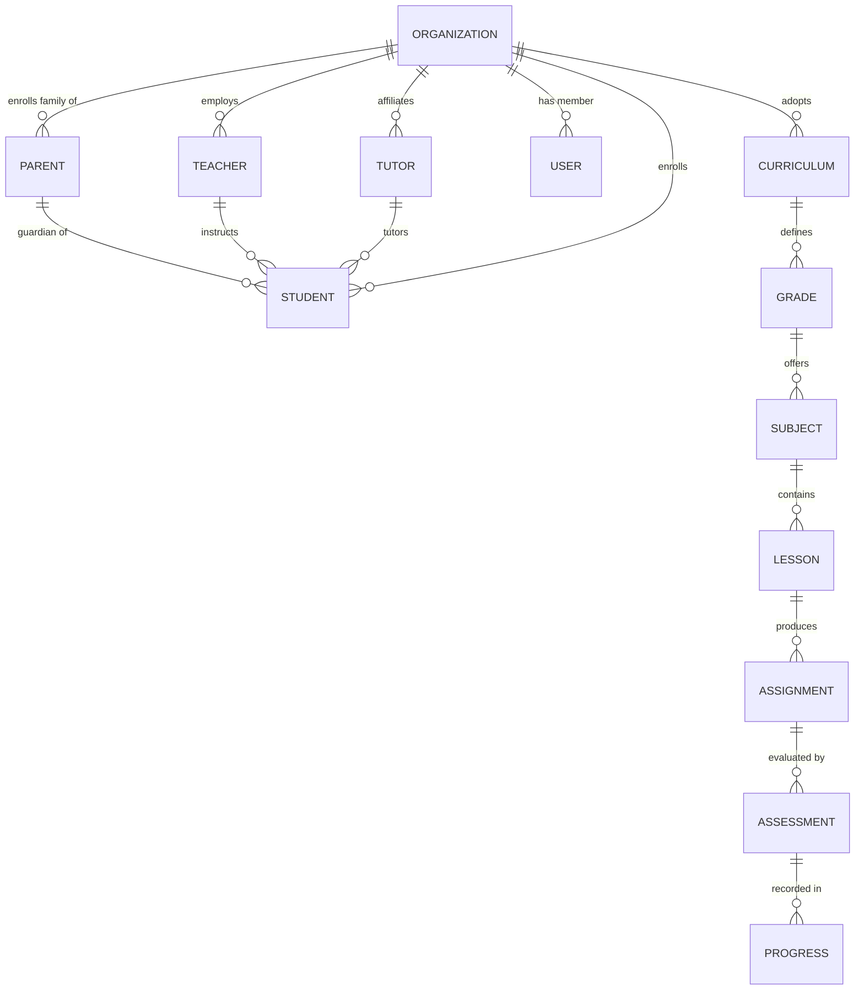

# Platform — Phase 3: Information Architecture

**Scope:** Information Architecture, Relationship Model, Sitemap, Navigation, Dashboard Hierarchy, User Journeys, Wireframe Descriptions.
**Status:** Draft — pending approval before Phase 4 (Functional Specifications).
**Builds on:** Phases 1–2 — approved. All prior decisions are authoritative except the revisions in Section 0.
**Altitude:** Structural and conceptual. Pixel-level mockups, full permission tables, and physical database schema are deferred to Phases 4, 5, and 7.

---

## 0. Carry-Forward Revisions from Phase 2

| # | Phase 2 Decision/Assumption | Phase 3 Status | Architectural Impact |
|---|---|---|---|
| 1 | English-only UI at MVP | Confirmed, unchanged | None. |
| 2 | Assumed one role per user account | **Reversed:** multi-role-per-account confirmed via RBAC; one user may hold multiple roles (e.g., Parent + Tutor), tenant-aware | Major. Requires Role Assignment as a concept distinct from User identity (Section 2). Drives the Role Context Switcher navigation pattern (Section 5). Will require a many-to-many User↔Role↔Organization structure in Phase 5. |
| 3 | Billing V1-scope, manual assignment at MVP | Confirmed, unchanged | None. |
| 4 | Messaging scope pending confirmation | Confirmed into MVP: basic Parent↔Teacher/Tutor conversations and notifications only | Messaging now appears in the Parent, Teacher, and Tutor sitemaps (Section 4) as MVP scope. |
| 5 | CBC content source pending confirmation | Confirmed platform-curated at MVP; architecture must support tenant-authored and licensed third-party content later | Content-authoring UI for tenant Teachers is not MVP IA scope, but the Curriculum/Lesson relationship (Section 2) must not assume a single content source. |
| 6 | Tutor accounts single-tenant at MVP | Confirmed, unchanged | None at MVP; noted for future Tutor↔multiple-Organization navigation. |
| 7 | Student independent login unresolved | Resolved: senior-secondary Students (Grades 10–12) may hold independent login credentials, still linked to a Parent/Guardian | Student sitemap (Section 4) assumes a real, independent Student portal for that age band. Younger students' access pattern needs explicit handling — see Questions Requiring Approval. |

---

## 1. Design Principles for This Phase

1. **Relationship-centric, not role-isolated.** Navigation and dashboards are built around the relationships in Section 2, not a flat list of six roles.
2. **Homeschooling-first, not school-first.** No workflow assumes a physical campus, fixed class periods, or a traditional school calendar unless a tenant's own settings require it. CBC's term structure is supported as configurable data, never hardcoded as a UI assumption.
3. **One navigation system, adapted by data.** The same role-based portal shell serves a Family, a Private School, a Learning Centre, or an NGO. Differences come from tenant settings and terminology, not a forked information architecture per tenant type.
4. **Multi-role-aware by default.** Any screen that reflects "your role" must account for a user holding more than one role, and let them move between role contexts without re-authenticating.

## 2. Relationship Model

The fifteen relationships below are first-class architectural concepts. They shape the sitemap (Section 4), navigation (Section 5), dashboards (Section 6), and user journeys (Section 7) in this document, and will formalize into the Phase 5 database schema and Phase 6 API design.

| Relationship | Cardinality | Notes |
|---|---|---|
| Parent/Guardian ↔ Student(s) | 1-to-many (as modeled) | A Parent may guard multiple Students. Whether a Student may have more than one linked guardian is unresolved — see Questions Requiring Approval. |
| Teacher ↔ Student(s) | many-to-many | A Teacher instructs many Students; a Student may have multiple Teachers across subjects. |
| Tutor ↔ Student(s) | many-to-many | Same pattern as Teacher, scoped to one tenant per the Phase 2 Tutor-scope decision. |
| Organization ↔ Users | 1-to-many, via Role Assignment | See the note below — this is really Organization ↔ Role Assignment. |
| Organization ↔ Curriculum | 1-to-many (typically one active at MVP) | A tenant adopts one primary curriculum at MVP (CBC); the architecture allows more than one later. |
| Organization ↔ Teachers | 1-to-many, via Role Assignment | Filtered view of Organization ↔ Users, scoped to the Teacher role. |
| Organization ↔ Tutors | 1-to-many, via Role Assignment | Filtered view of Organization ↔ Users, scoped to the Tutor role. |
| Organization ↔ Parents | 1-to-many, via Role Assignment | Filtered view of Organization ↔ Users, scoped to the Parent role. |
| Organization ↔ Students | 1-to-many | Every Student profile belongs to exactly one Organization at MVP. |
| Curriculum ↔ Grades | 1-to-many | E.g., CBC defines pre-primary through Grade 12. |
| Grades ↔ Subjects | 1-to-many | Subjects vary by grade level per curriculum rules. |
| Subjects ↔ Lessons | 1-to-many | |
| Lessons ↔ Assignments | 1-to-many | A Lesson may generate zero or more Assignments. |
| Assignments ↔ Assessments | 1-to-many | An Assignment may be evaluated through one or more Assessments. |
| Assessments ↔ Progress Tracking | 1-to-many | Every Assessment result feeds the Student's Progress record for that competency. |

**Insight connecting this to Phase 2:** four of the fifteen relationships (Organization↔Users, ↔Teachers, ↔Tutors, ↔Parents) are the same underlying relationship — Organization↔Role Assignment — viewed through different role filters. This is a direct consequence of the Phase 2 multi-role decision: since one User may hold more than one Role, "membership in an Organization" is a property of a Role Assignment, not of the User identity itself. This is what makes the Role Context Switcher (Section 5) necessary, and it will be the basis for the Phase 5 schema's core join structure.

## 3. Information Architecture

The relationship model splits into two intersecting spines:

**People Spine:** Organization → Role Assignment → User, with Parent↔Student, Teacher↔Student, and Tutor↔Student as the cross-links connecting people to the learners they support.

**Content Spine:** Organization → Curriculum → Grade → Subject → Lesson → Assignment → Assessment → Progress.

The two spines intersect at Assignment and Progress: a Student (People Spine) is assigned an Assignment (Content Spine) by a Teacher or Tutor (People Spine), and the resulting Assessment produces a Progress record attributed to that Student, closing the loop back to the People Spine. Structurally, every screen in the platform is a view onto one spine, filtered by a position on the other — a Parent's dashboard is the Content Spine filtered by "my linked Students"; a Teacher's gradebook is the Content Spine filtered by "students I instruct."

## 4. Sitemap

**Student Portal** (independent login: senior secondary only, per Phase 2 Decision 7)
- Dashboard — today's lessons/assignments, progress snapshot
- My Lessons (by Subject)
- My Assignments
- My Progress
- Messages
- Profile/Settings

**Parent/Guardian Portal**
- Dashboard — all linked Students at a glance
- My Children → per-child detail (progress, assignments, lessons)
- Messages (Teacher/Tutor conversations)
- Subscription & Plan (manual/trial at MVP, per Phase 2 Decision 3)
- Settings

**Teacher Portal**
- Dashboard — assigned students overview
- My Students
- Lessons & Content (within the tenant's adopted Curriculum)
- Assignments (create/grade)
- Messages
- Reports (student/class progress)

**Tutor Portal**
- Dashboard — personal roster overview
- My Students
- Lessons & Content
- Assignments (create/grade)
- Messages
- Reports

**Organization Administrator Portal**
- Dashboard — org-wide summary
- Users (manage Teachers, Tutors, Parents, Students, and Role Assignments)
- Curriculum (org's adopted curriculum and settings)
- Reports (org-wide)
- Organization Settings (locale/currency defaults, branding placeholder fields)

**Super Administrator Portal**
- Dashboard — platform-wide health
- Tenants (list, create, suspend)
- Users (platform-wide search/support)
- Audit Logs
- System Settings

**Homeschooling-first note (proposed, pending approval):** for Family-type tenants, the Parent/Guardian and Organization Administrator roles are typically held by the same person. Recommend the UI merge the Organization Administrator nav items into the Parent portal for Family tenants specifically, rather than presenting a separate "Organization Administrator" portal shell for a single-parent-run household. This is a presentation-layer adaptation only — the same roles, permissions, and data model apply underneath; a Private School or Academy tenant still sees the full, separate Organization Administrator portal. Flagged in Questions Requiring Approval.

## 5. Navigation

- **Layout:** persistent sidebar (desktop) / bottom or slide-out navigation (mobile), scoped to the active Role Context.
- **Role Context Switcher:** appears in the top navigation whenever a User holds more than one Role Assignment; hidden entirely for single-role users to avoid unnecessary complexity.
- **Organization/tenant switcher:** not needed at MVP, since every Role Assignment points at the single active tenant. The navigation reserves this slot for V1, when a Tutor or Parent could plausibly hold role assignments in more than one Organization.
- **Global elements present regardless of role:** Messages, Notifications, Profile/Settings.

## 6. Dashboard Hierarchy

| Role | Dashboard focus |
|---|---|
| Student | Today's lessons/assignments, progress snapshot, recent feedback |
| Parent/Guardian | One card per linked Student: progress, next-due assignment, unread messages |
| Teacher / Tutor | Roster overview, pending grading queue, unread messages |
| Organization Administrator | Tenant-wide counts by role, org-level progress rollup, pending invitations |
| Super Administrator | Platform-wide tenant list and health, support queue, audit log highlights |

## 7. User Journeys

**Journey A — Parent onboarding and linking a Student**
1. Parent registers, creating an Organization (Family tenant) or accepting an invitation into an existing Organization.
2. Parent creates a Student profile, establishing the Parent↔Student relationship.
3. The Student inherits the Organization's adopted Curriculum (Organization↔Curriculum) and a Grade placement.
4. Grade placement exposes the relevant Subjects and Lessons.

**Journey B — Teacher/Tutor assigning and tracking work**
1. Teacher/Tutor views their linked Students (Teacher↔Student / Tutor↔Student).
2. Selects a Lesson from the Content Spine and creates an Assignment.
3. Student completes the Assignment; an Assessment is generated and graded.
4. The Assessment result writes a Progress record, visible to the Student, their Parent, and the assigning Teacher/Tutor.

**Journey C — Multi-role context switch**
1. A user holding both a Parent and a Tutor Role Assignment logs in once.
2. Lands in their most-recently-used Role Context (first login prompts a choice).
3. Uses the Role Context Switcher to move from "Parent" (their own children) to "Tutor" (their tutored students) without re-authenticating.

**Journey D — Organization Administrator onboarding a Teacher**
1. Org Admin invites a new Teacher by email.
2. Invitee accepts, creating a User identity (if new) and a Teacher Role Assignment scoped to that Organization.
3. Org Admin links the Teacher to specific Students — exact mechanism (direct assignment vs. subject/grade-based) is Phase 4 detail.

## 8. Wireframe Descriptions

**Parent Dashboard**
Top bar: Role Context Switcher (if multi-role), Notifications, Profile menu. Primary nav: My Children, Messages, Subscription, Settings. Main content: one card per linked Student showing name, grade, progress bar, next-due assignment, and unread-message indicator; clicking a card opens that Student's detail view.

**Student Dashboard**
Top bar: Notifications, Profile menu (no Role Context Switcher — Students hold a single role). Main content: a "Today" section (due lessons/assignments), a "My Subjects" grid, and a progress summary strip.

**Teacher/Tutor Roster View**
Left panel: student roster, filterable by Subject/Grade. Right panel: selected student's pending assignments, recent assessments, and a message shortcut.

**Assignment Creation**
Four-step flow: (1) select a Lesson from the Content Spine, (2) select target Student(s) from the People Spine, (3) set due date and instructions, (4) review and publish.

---

## Phase 3 Review

### Architectural Decisions Made
1. The Relationship Model (Section 2) is formalized as fifteen named relationships and is now authoritative terminology for all future phases.
2. Organization↔Users/Teachers/Tutors/Parents are documented as filtered views of a single underlying Organization↔Role Assignment relationship — a direct consequence of the Phase 2 multi-role decision.
3. Navigation is built around one adaptive role-based portal shell plus a Role Context Switcher, not a separate navigation system per tenant type or role combination.
4. The two-spine framing (People Spine / Content Spine) is adopted as the structural model behind every dashboard and journey in this document.
5. Wireframe descriptions stay textual/structural per the master prompt's Phase 3 definition; pixel-level mockups remain out of scope until later phases.

### Assumptions
1. A Student has exactly one linked Parent/Guardian at MVP; multi-guardian linking is not assumed.
2. First login for a multi-role user prompts a Role Context choice; subsequent logins default to the last-used context.
3. Younger Students (below senior secondary) have no independent dashboard/login at MVP and are represented entirely through the Parent portal.
4. A Teacher/Tutor's link to a Student requires an explicit Org Admin or Parent action (invitation/assignment), not self-service browsing by the Teacher/Tutor.

### Risks
1. **Role Context Switcher complexity:** a real UX and session/permission pattern to build correctly, adding engineering surface beyond the Phase 2 roadmap delta already flagged.
2. **Family/Org-Admin merge risk:** the Section 4 proposal is a deliberate, data-driven exception to Design Principle 3. Worth confirming it stays a presentation-layer adaptation (same components, different composition) rather than becoming a second forked IA in practice.
3. **Multi-guardian gap:** if a Student needs more than one linked guardian (common in real households — shared custody, co-parenting, guardianship transfers), Parent↔Student changes from 1-to-many to many-to-many before Phase 5 — cheaper to resolve now than after schema design.
4. **Younger-Student access gap:** Phase 2 only resolved independent login for Grades 10–12. This document assumes full Parent-mediation below that band; needs confirmation before Phase 4 designs the actual permission/workflow detail.

### Questions Requiring Approval
1. Confirm Student↔Parent/Guardian as many-to-many (more than one linked guardian per Student), or 1-to-many as assumed.
2. Confirm the proposed Family-tenant merge of the Organization Administrator navigation into the Parent portal.
3. Confirm younger Students (below Grades 10–12) have no independent dashboard/login at MVP.
4. Confirm Teacher/Tutor↔Student linking requires an explicit Org Admin or Parent action rather than Teacher/Tutor self-service.
5. Confirm the two-spine framing and the fifteen-relationship model in Section 2 as documented.
6. Approve Phase 3 to proceed to Phase 4 (Functional Specifications).
