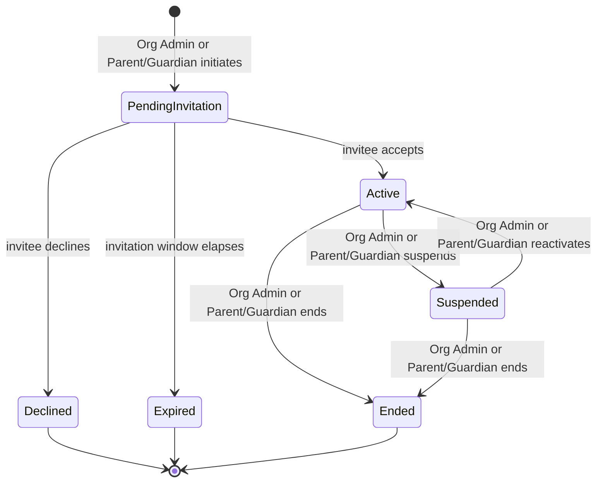

# Platform — Phase 4: Functional Specifications

**Scope:** Detailed functional specifications for every module, dashboard, workflow, and user permission.
**Status:** Draft — pending approval before Phase 5 (Database Architecture).
**Builds on:** Phases 1–3 — approved. All prior decisions are authoritative except the revisions in Section 0.
**Altitude:** Behavioral detail — business rules, workflows, and permissions. Physical schema (tables, keys, RLS policy syntax) is deferred to Phase 5; API contracts to Phase 6; visual design to Phase 7.

---

## 0. Carry-Forward Revisions from Phase 3

| # | Phase 3 Item | Phase 4 Status | Impact |
|---|---|---|---|
| 1 | Student↔Parent/Guardian cardinality unresolved | Confirmed many-to-many; must support shared custody, multiple guardians, foster care, legal guardianship | Shapes the Relationship Entity's `role_subtype` field (Section 1). |
| 2 | Family-tenant Org-Admin/Parent nav merge proposed | Confirmed, presentation-layer only; RBAC/permissions/role assignments unchanged underneath | Realized through widget composition (Section 2), not a separate implementation. |
| 3 | Younger-Student access assumed fully Parent-mediated | Refined: Parent-mediated at MVP, but the architecture must support future tenant-configurable independent logins for younger Students without redesign | Independent-login eligibility becomes a tenant-configurable policy value, not a hardcoded age gate (FR-1, FR-2). |
| 4 | Teacher/Tutor↔Student linking requires explicit Org Admin/Parent action | Confirmed and extended: Teachers/Tutors must never self-enroll or self-associate | Encoded as a hard rule in the Permission Matrix (Section 4), not just a workflow convention. |
| 5 | Two-spine framing and fifteen-relationship model | Confirmed authoritative | Unchanged; used throughout this document. |
| — | New: relationships as first-class entities with metadata | New directive | Section 1. |
| — | New: modular dashboard architecture (shared shell + widgets) | New directive | Section 2. |

---

## 1. Relationship Entities

Per the approved directive, Parent↔Student, Teacher↔Student, and Tutor↔Student are modeled as first-class **Relationship Entities**, not simple foreign-key links, sharing one metadata pattern:

- **relationship_type** — Parent-Student / Teacher-Student / Tutor-Student
- **role_subtype** — e.g., for Parent-Student: Biological Parent, Legal Guardian, Foster Parent, Other Guardian
- **status** — Pending Invitation, Active, Suspended, Ended
- **permission_level** — what this specific relationship instance grants (e.g., Full-Management vs. View-Only for a co-guardian)
- **start_date / end_date** — end_date nullable/open-ended by default; required for time-bounded scenarios (foster placement, term-limited tutoring, school-year teacher assignment)
- **invitation_status** — Sent, Accepted, Declined, Expired — tracks the invite step distinctly from overall `status`
- **created_by / audit_history** — who initiated the relationship (always an Organization Administrator or a Parent/Guardian with Full-Management permission — never the Teacher or Tutor) and a full change log

**Lifecycle state machine (shared across all three relationship types):**

Note that Teacher and Tutor never appear as an actor on any transition — consistent with the rule that they never self-enroll or self-associate.

**Applied per relationship type:**

**Parent/Guardian ↔ Student** — many-to-many. A Student may have multiple simultaneous Active relationships (e.g., two co-parents, or a biological parent plus a court-appointed guardian); a Parent/Guardian may link to multiple Students. `permission_level` allows one guardian to hold Full-Management (billing, inviting Teachers/Tutors, editing profile) while another holds View-Only — relevant to shared-custody scenarios. Initiated by an existing Full-Management Parent/Guardian (inviting a co-guardian) or an Organization Administrator (e.g., an NGO caseworker assigning a guardian of record).

**Teacher ↔ Student** — many-to-many. `role_subtype` may later scope to a specific Subject (e.g., "Mathematics Teacher"); left as schema headroom, not resolved at this phase. Initiated by an Organization Administrator or a Full-Management Parent/Guardian.

**Tutor ↔ Student** — many-to-many, tenant-scoped at MVP per the Phase 2 Tutor-scope decision. Same initiation rule as Teacher↔Student.

## 2. Modular Dashboard Architecture

A shared **Dashboard Shell** (top bar: Role Context Switcher, Notifications, Profile menu; content area: a permission-filtered grid of widgets) replaces separate per-role dashboard implementations. Each role's dashboard is a specific composition of reusable widgets.

**Widget catalog**

| ID | Widget | Data source | Used by |
|---|---|---|---|
| W-1 | Linked-Student Card | Active Parent↔Student relationships | Parent/Guardian |
| W-2 | Today's Work | Content Spine, filtered to viewing Student | Student |
| W-3 | Subject Grid | Content Spine, filtered to Student's Grade/Pathway | Student |
| W-4 | Progress Summary | Progress records, scoped by Active relationship | Student, Parent, Teacher, Tutor |
| W-5 | Roster List | Active Teacher/Tutor↔Student relationships | Teacher, Tutor |
| W-6 | Grading Queue | Assignments in `Submitted` status | Teacher, Tutor |
| W-7 | Messages Preview | Active relationships with message history | Parent, Teacher, Tutor, senior-secondary Student |
| W-8 | Org User Counts | Role Assignments, tenant-scoped | Organization Administrator |
| W-9 | Org Progress Rollup | Progress records, tenant-scoped | Organization Administrator |
| W-10 | Pending Invitations | Relationship Entities in `Pending Invitation` status | Organization Administrator, Full-Management Parent/Guardian |
| W-11 | Tenant Health | Platform-wide tenant metrics | Super Administrator |
| W-12 | Support/Audit Queue | Audit log, platform-wide | Super Administrator |

**Per-role composition**

| Role | Widgets |
|---|---|
| Student (senior secondary, independent login) | W-2, W-3, W-4, W-7 |
| Student (younger, Parent-mediated at MVP) | No independent dashboard at MVP |
| Parent/Guardian | W-1, W-4 (per child), W-7, W-10 (if Full-Management) |
| Teacher | W-5, W-4 (per student), W-6, W-7 |
| Tutor | W-5, W-4 (per student), W-6, W-7 |
| Organization Administrator (standard tenant) | W-8, W-9, W-10 |
| Organization Administrator (Family tenant, merged) | W-1, W-4, W-7, W-10 — the Parent widget set, since the Family Org Admin and Parent are the same person |
| Super Administrator | W-11, W-12 |

The Family-tenant merge from Phase 3 falls directly out of this table — it required no separate dashboard implementation, only a different widget composition, confirming that design as a genuine presentation-layer adaptation.

## 3. Module-by-Module Functional Specifications

**FR-1 Authentication & Account Management**
- Registration: email + password via Supabase Auth; email verification required before any role-specific portal is accessible.
- Password reset: single-use, time-limited emailed link.
- A User's first Role Assignment is created either at self-registration (a Parent/Guardian starting a Family tenant) or via an invitation-accept flow (every other case, including a Student with independent login).
- A User may exist with zero active Role Assignments only transiently, between registration and the first invitation/tenant creation; such a User has no accessible portal.
- Independent-login eligibility for a Student is a tenant-configurable policy value (default: disabled below senior secondary), not a hardcoded age check — per Section 0, Item 3.

**FR-2 Organization & Tenant Management**
- MVP: only the platform creates the single active tenant; self-service creation of additional Organizations is V1.
- Organization Administrator-editable settings: name, default Curriculum, locale/currency defaults, tenant type (Family / Tutor / Private School / Academy / Learning Centre / NGO), and the younger-Student independent-login policy toggle referenced in FR-1.
- Tenant type is set at creation and not freely re-editable at MVP — changing it has cascading presentation implications (Section 2) out of scope for MVP.

**FR-3 User & Role Management (RBAC)**
- A **Role Assignment** ({User, Organization, Role, status}) is distinct from a **Relationship** (Section 1). Holding a Parent/Guardian Role Assignment in an Organization is a prerequisite for creating Parent↔Student Relationships within that Organization, but the two records are separate.
- Six roles, unchanged: Student, Parent/Guardian, Teacher, Tutor, Organization Administrator, Super Administrator; one User may hold several Role Assignments simultaneously.
- Role Assignments for Teacher/Tutor/Organization Administrator are created via Organization Administrator invitation (FR-1's accept flow).

**FR-4 Curriculum & Content Management**
- CBC at MVP: Pre-Primary, Primary (Grades 1–6), Junior Secondary (Grades 7–9), Senior Secondary (Grades 10–12).
- Pathway selection (STEM / Social Sciences / Arts & Sports Science) is captured once at Grade 10 entry and determines available Subjects for Grades 10–12, mirroring Kenya's CBC senior-school structure.
- Content is platform-curated at MVP; the Curriculum→Grade→Subject→Lesson chain (Phase 3 Content Spine) does not assume a single-author constraint, enabling tenant-authored and licensed content later without redesign.

**FR-5 Learning Delivery (Lessons & Assignments)**
- A Student sees Lessons matching their current Grade and, if senior secondary, selected Pathway.
- Assignment creation is restricted to a Teacher or Tutor with an Active relationship to the target Student, or an Organization Administrator — not a Parent/Guardian without a separate Teacher/Tutor Role Assignment. Flagged as a question: this may not fit a self-directed homeschooling parent well (see Questions Requiring Approval).
- Assignment states: Not Started → In Progress → Submitted → Graded, with an Overdue flag if the due date passes unsubmitted.

**FR-6 Progress Tracking & Assessment**
- Every graded Assessment writes a Progress record scoped to {Student, Subject, Competency}.
- Progress visibility is gated by Active relationship status: a Parent sees Progress only for Students with an Active Parent↔Student relationship; a Teacher/Tutor sees Progress only for Students with an Active relationship to them. This is the enforcement pattern Phase 5's RLS policies will implement directly.

**FR-7 Communication**
- MVP scope: simple 1:1 conversations between a Parent/Guardian and a Teacher/Tutor who share an Active relationship (directly, or via the linked Student).
- Younger Students have no messaging at MVP (Parent-mediated). Whether senior-secondary Students with independent login can send messages, not just view them, is unresolved — see Questions Requiring Approval.
- Forums and group messaging remain V2, unchanged.

**FR-8 Subscription & Plan Management**
- Manual/trial plan assignment at MVP; an Organization Administrator (or the Parent, under the Family-tenant merge) selects a plan — no live payment processing.
- Plan entitlement limits (e.g., a Family plan's maximum linked Student profiles) are enforced at the point of Student-profile creation and Relationship creation, not merely displayed.

**FR-9 Notifications**
- In-app triggers: new Message (FR-7), Assignment due-soon/Overdue (FR-5), new Progress record (FR-6), new Relationship invitation (Section 1).
- Email notifications remain limited to account/security events at MVP (FR-1).

**FR-10 Reporting & Analytics**
- Parent: per-child Progress Summary (W-4), scoped by Active relationships.
- Teacher/Tutor: per-student Progress Summary (W-4), scoped by Active relationships.
- Organization Administrator: Org Progress Rollup (W-9), aggregated across all Active Students in the tenant.

**FR-11 Platform Administration (Super Admin)**
- Tenant Health (W-11) must reflect real data even with one active tenant at MVP, not placeholder values.
- Every Relationship state transition (Section 1) and every Role Assignment change is a mandatory audit-log event.

## 4. Permission Matrix

| Action / Resource | Student | Parent/Guardian | Teacher | Tutor | Org Admin | Super Admin |
|---|---|---|---|---|---|---|
| Create a Parent↔Student, Teacher↔Student, or Tutor↔Student relationship | No | Yes — own relationships only (Full-Management) | No — never self-associate | No — never self-associate | Yes — tenant-scoped | Yes — platform-wide |
| View a Student's Progress | Own only | Linked Students only (Active relationship) | Assigned Students only (Active relationship) | Assigned Students only (Active relationship) | Tenant-wide | Platform-wide |
| Create/edit an Assignment | No | No — see Questions Requiring Approval | Assigned Students only | Assigned Students only | Tenant-wide | Platform-wide |
| Grade an Assessment | No | No | Assigned Students only | Assigned Students only | Tenant-wide | Platform-wide |
| Send a Message | Senior secondary only, to linked Teacher/Tutor (pending confirmation) | To linked Teacher/Tutor (Active relationship) | To linked Parent/Guardian (Active relationship) | To linked Parent/Guardian (Active relationship) | No (administrative role, not instructional) | No |
| Manage Organization settings | No | No, unless also holding an Org Admin Role Assignment (e.g., Family-tenant merge) | No | No | Yes — own tenant only | Yes — any tenant |
| Invite a User (create Role Assignment) | No | No | No | No | Yes — own tenant only | Yes — any tenant |
| Manage Subscription/Plan | No | Yes — Full-Management permission_level only | No | No | Yes — own tenant only | Yes — any tenant |
| View Audit Log | No | No | No | No | Own tenant only | Platform-wide |
| Manage Tenants (create/suspend) | No | No | No | No | No | Yes |

## 5. Detailed Workflows

**Workflow: Relationship Invitation**
1. Initiator (Organization Administrator, or Parent/Guardian with Full-Management permission_level) selects "Add Teacher/Tutor," "Add Co-Guardian," or "Add Student."
2. System checks the initiator's permission against Section 4 and confirms the Organization's plan entitlements (FR-8) are not exceeded.
3. A Relationship Entity is created in `Pending Invitation` status with role_subtype, permission_level, and optional start/end dates.
4. The invitee is notified (FR-9); if new to the platform, an account-creation prompt is included (FR-1).
5. The invitee accepts (→ `Active`), declines (→ `Declined`), or the invitation window elapses (→ `Expired`, default 14 days — flagged as a placeholder value).
6. Every transition is written to the audit log (FR-11).

**Workflow: Assignment → Assessment → Progress**
1. A Teacher/Tutor with an Active relationship to the Student selects a Lesson from the Content Spine and creates an Assignment with a due date.
2. The Assignment starts `Not Started`; it appears under the Student's Today's Work (W-2) once due-soon.
3. The Student's engagement moves it to `In Progress`, then `Submitted`.
4. The Teacher/Tutor grades it, producing an Assessment and moving the Assignment to `Graded`.
5. The Assessment writes a Progress record per the FR-6 visibility rule.
6. If unsubmitted past the due date, the Assignment is flagged `Overdue`, triggering a notification to both the Student and their linked Parent/Guardian — a new rule proposed in this phase, not previously specified.

---

## Phase 4 Review

### Architectural Decisions Made
1. Relationship Entities (Parent↔Student, Teacher↔Student, Tutor↔Student) formalized with a shared metadata pattern and a common lifecycle state machine (Section 1).
2. Role Assignment and Relationship are confirmed as distinct entities; a Role Assignment of the relevant type is a prerequisite for creating a Relationship, but the records are separate (FR-3).
3. Modular Dashboard Architecture implemented as a twelve-widget catalog composed per role through a shared Dashboard Shell (Section 2); the Family-tenant merge is realized purely through widget composition.
4. Progress and Message visibility are both gated by Active relationship status — one enforcement pattern used throughout, setting up Phase 5's RLS design directly.
5. The Permission Matrix (Section 4) encodes "Teacher/Tutor never self-associate" as an explicit action-level rule, not just a workflow convention.

### Assumptions
1. Tenant type is set at creation and not freely re-editable at MVP.
2. Assignment creation is restricted to Teacher/Tutor/Org Admin; a Parent/Guardian without a Teacher or Tutor Role Assignment cannot directly create Assignments for their own child.
3. Relationship invitations expire after 14 days if not actioned — a placeholder value.
4. Senior-secondary Students with independent login can send Messages, not only view them.
5. An overdue Assignment notifies both the Student and their Parent/Guardian.

### Risks
1. **Parent-as-instructor gap:** many homeschooling parents act as their child's primary instructor without a separate Teacher/Tutor identity. As specified, such a parent cannot create Assignments unless they also hold a Teacher or Tutor Role Assignment. This may cut against the homeschooling-first principle established in Phase 3 and is worth resolving before Phase 5 fixes the permission model in schema/RLS.
2. **Relationship metadata scope vs. MVP delivery:** the full metadata set in Section 1 is real design surface across three relationship types simultaneously; Phase 5 will need to decide how much ships at MVP versus exists only as schema headroom.
3. **Widget permission complexity:** composing twelve widgets by role, tenant type, and permission_level (Section 2) is more moving parts than fixed per-role dashboards; Phases 6–7 need a clean rule-evaluation approach that doesn't become unmanageable.
4. **Sensitive relationship metadata:** role_subtype values such as Foster Parent may themselves be sensitive data in some jurisdictions; flagged for Phase 8's security/compliance work, not resolved here.

### Questions Requiring Approval
1. Confirm whether a Parent/Guardian without a separate Teacher/Tutor Role Assignment may create Assignments directly for their own linked Student.
2. Confirm the 14-day relationship-invitation expiry window, or specify a different value.
3. Confirm senior-secondary Students with independent login may send Messages, not only view them.
4. Confirm the proposed overdue-Assignment notification rule (Student + Parent/Guardian).
5. Confirm tenant type is fixed at creation for MVP.
6. Approve Phase 4 to proceed to Phase 5 (Database Architecture).
