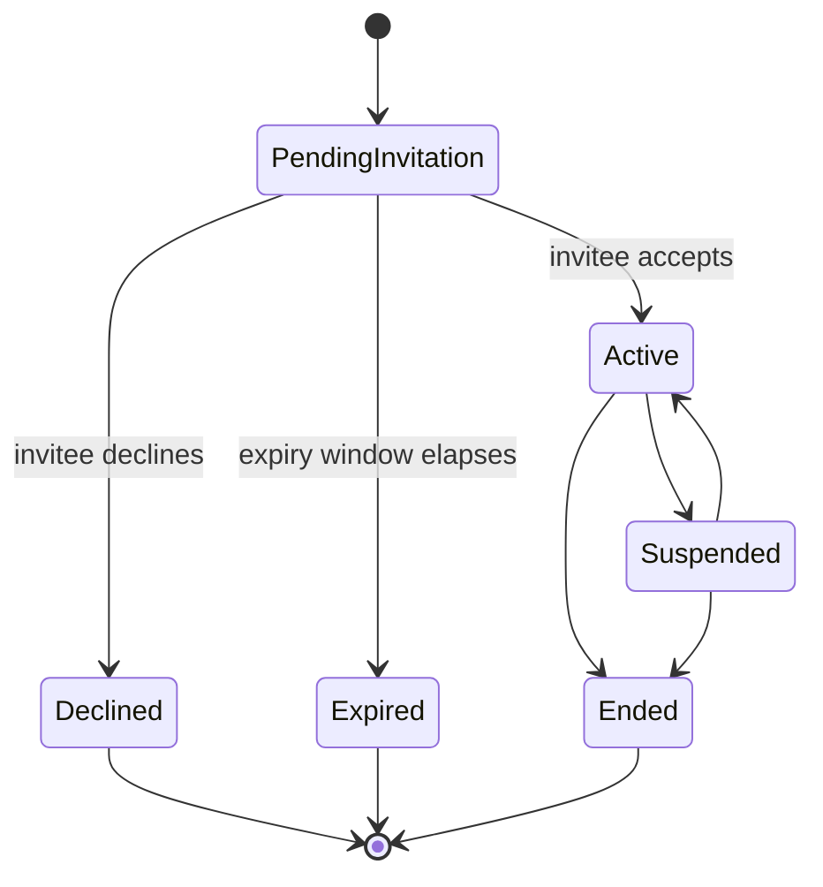

# Platform — Phase 5: Database Architecture

**Scope:** PostgreSQL schema, entity relationships, tenant model, Row-Level Security policies, authentication model, storage buckets, indexes, constraints. Explains how tenant isolation is achieved.
**Status:** Approved, then refined in place — relationship/membership/role-assignment tables now follow a single standardized structural pattern (this revision). See Section 0 for the full change record.
**Builds on:** Phases 1–4 — approved.
**Note on SQL:** all SQL in this document is illustrative — it expresses the intended schema and access-control logic precisely, but has not been executed against a live database. Validate (e.g., via Supabase's local CLI) before production use.

---

## 0. Change Record — Relationship Table Consistency Refinement

This revision applies a single standardized structure to every relationship/membership/role-assignment entity, replacing the shapes used in the prior version of this document. No previously approved business rule changes; this is a structural consistency pass.

| Area | Before this revision | After this revision |
|---|---|---|
| Naming | `role_assignments` | Renamed to **`user_roles`**, resolving the naming question raised in Phase 6 — "User Role" is the standing term from here on. |
| Role vocabulary | `role text check (...)` on `role_assignments` | New `roles` lookup table; `user_roles.role_id` references it. New roles are added by inserting a row, not altering a constraint — a further step in the same direction as the earlier TEXT+CHECK decision, not a reversal of it. |
| Relationship FKs | `party_role_assignment_id` on each relationship table | Renamed to the specific, readable `parent_id`, `teacher_id`, `tutor_id` (referencing `profiles.id` directly) |
| Tenant scoping | Derived indirectly, via a join through `students` | `organization_id` is now a direct column on every relationship/membership/role table — simpler queries, simpler RLS, better indexing |
| Membership fields | `invited_by`, `joined_at` | Folded into the standardized `created_by`, `created_at` — they recorded the same fact |
| Audit fields | `created_by` only | `created_by` **and** `updated_by` on every standardized table, maintained automatically by a shared trigger |
| Date fields | `start_date` / `end_date` | Renamed to `effective_from` / `effective_to` |
| `relationship_type` column | N/A (already removed when the polymorphic design was split into three tables) | Still correctly absent — the table itself identifies the type; adding it back would be redundant |
| Downstream FKs | `assignments.created_by_role_assignment_id`, `assessments.graded_by_role_assignment_id`, `conversation_participants.role_assignment_id`, `messages.sender_role_assignment_id`, `notifications.recipient_role_assignment_id`, `students.role_assignment_id` | Renamed to `..._user_role_id` throughout, matching the `user_roles` rename |

**Scoping note:** the full standardized structure (organization_id, status, effective_from/to, notes, audit_reference, created_by/updated_by) is applied rigorously to the five entities named in the request — `parent_student_relationships`, `teacher_student_relationships`, `tutor_student_relationships`, `organization_memberships`, `user_roles`. Other tables (`assignments`, `assessments`, `conversation_participants`, `messages`, `notifications`) are core business entities, not relationship entities in the Phase 3/4 sense — they only needed their FK column names updated to match the `user_roles` rename, not the full structural pattern, per the instruction to avoid unnecessary columns added purely for consistency.

Metadata fields are included only where meaningful for that specific relationship:

| Field | Parent-Student | Teacher-Student | Tutor-Student |
|---|---|---|---|
| `role_subtype` | Yes (biological/legal/foster/other guardian) | No | No |
| `permission_level` | Yes (full-management vs. view-only) | No | No |
| `subject_id` (scope) | No | Yes | Yes |
| `audit_reference` | Yes (e.g., a legal/case reference) | No — no analogous concept at MVP | No |
| `notes` | Yes | Yes | Yes |

---

## 1. Entity Categories & Relationship Mapping

- **Identity entities** (Section 2) — who someone is, independent of any organization.
- **Membership entities** (Section 3) — that a User belongs to an Organization at all.
- **Role Assignment entities** (Section 3) — what a Membership is permitted to do; one User may hold several per Organization.
- **Core business entities** (Sections 5–6) — the Content Spine and Student/Learning data.
- **Relationship (junction) entities** (Section 7) — Parent↔Student, Teacher↔Student, Tutor↔Student, each its own dedicated table, now sharing one standardized structure.
- **Platform Configuration** (Section 4) — settings adjustable without a schema change.

**Mapping back to the Phase 3 relationship model:**

| Phase 3 Relationship | Physical Implementation |
|---|---|
| Parent/Guardian ↔ Student(s) | `parent_student_relationships` (many-to-many) |
| Teacher ↔ Student(s) | `teacher_student_relationships` (many-to-many) |
| Tutor ↔ Student(s) | `tutor_student_relationships` (many-to-many) |
| Organization ↔ Users | `organization_memberships` |
| Organization ↔ Curriculum | `organizations.default_curriculum_id → curricula` |
| Organization ↔ Teachers / Tutors / Parents | `user_roles` filtered by `role_id` |
| Organization ↔ Students | `students.organization_id` |
| Curriculum ↔ Grades | `grades.curriculum_id` |
| Grades ↔ Subjects | `subjects.grade_id` |
| Subjects ↔ Lessons | `lessons.subject_id` |
| Lessons ↔ Assignments | `assignments.lesson_id` |
| Assignments ↔ Assessments | `assessments.assignment_id` |
| Assessments ↔ Progress Tracking | `progress_records.assessment_id` |

## 2. Identity Entities

```sql
create table public.profiles (
  id uuid primary key references auth.users(id) on delete cascade,
  full_name text not null,
  locale text not null default 'en',
  timezone text not null default 'Africa/Nairobi',
  created_at timestamptz not null default now(),
  updated_at timestamptz not null default now()
);

-- Super Administrator is platform-scoped, not tenant-scoped — a justified
-- exception to the organization_id standard, since there is no tenant to scope to.
create table public.platform_admins (
  id uuid primary key default gen_random_uuid(),
  user_id uuid not null unique references public.profiles(id) on delete cascade,
  status text not null default 'active' check (status in ('active','revoked')),
  created_at timestamptz not null default now(),
  updated_at timestamptz not null default now(),
  created_by uuid references public.profiles(id),
  updated_by uuid references public.profiles(id)
);
```

## 3. Membership & Role Assignment Entities

```sql
create table public.organizations (
  id uuid primary key default gen_random_uuid(),
  name text not null,
  tenant_type text not null check (tenant_type in
    ('family','independent_tutor','private_school','homeschool_academy','learning_centre','ngo')),
  default_curriculum_id uuid, -- FK added below, after curricula exists
  default_locale text not null default 'en',
  default_currency text not null default 'KES',
  timezone text not null default 'Africa/Nairobi',
  younger_student_independent_login boolean not null default false,
  branding jsonb not null default '{}'::jsonb, -- placeholder; unused at MVP
  created_at timestamptz not null default now(),
  updated_at timestamptz not null default now()
);

-- Standardized structure. invited_by/joined_at folded into created_by/created_at.
create table public.organization_memberships (
  id uuid primary key default gen_random_uuid(),
  organization_id uuid not null references public.organizations(id) on delete cascade,
  user_id uuid not null references public.profiles(id) on delete cascade,
  status text not null default 'active' check (status in ('active','suspended','ended')),
  created_at timestamptz not null default now(),
  updated_at timestamptz not null default now(),
  created_by uuid references public.profiles(id),
  updated_by uuid references public.profiles(id),
  unique (user_id, organization_id)
);

-- New lookup table: adding a role is an INSERT, not an ALTER TABLE / CHECK edit —
-- a further step in the same direction as the TEXT+CHECK decision, applied to the
-- single most consequential vocabulary in the schema.
create table public.roles (
  id uuid primary key default gen_random_uuid(),
  code text not null unique,
  name text not null,
  created_at timestamptz not null default now()
);

insert into public.roles (code, name) values
  ('student', 'Student'),
  ('parent_guardian', 'Parent/Guardian'),
  ('teacher', 'Teacher'),
  ('tutor', 'Tutor'),
  ('org_admin', 'Organization Administrator');

-- Renamed from role_assignments. organization_id and user_id are now direct
-- columns (matching the standardized pattern); the composite foreign key still
-- guarantees a User Role cannot exist without a corresponding active Membership.
create table public.user_roles (
  id uuid primary key default gen_random_uuid(),
  organization_id uuid not null references public.organizations(id) on delete cascade,
  user_id uuid not null references public.profiles(id) on delete cascade,
  role_id uuid not null references public.roles(id),
  status text not null default 'active' check (status in ('active','suspended','ended')),
  created_at timestamptz not null default now(),
  updated_at timestamptz not null default now(),
  created_by uuid references public.profiles(id),
  updated_by uuid references public.profiles(id),
  foreign key (user_id, organization_id) references public.organization_memberships(user_id, organization_id),
  unique (user_id, organization_id, role_id)
);
```

## 4. Platform Configuration

```sql
create table public.system_settings (
  key text primary key,
  value jsonb not null,
  description text,
  updated_by uuid references public.profiles(id),
  updated_at timestamptz not null default now()
);

insert into public.system_settings (key, value, description) values
  ('relationship_invitation_expiry_days', '14', 'Days before a pending relationship invitation expires');
```

## 5. Core Business Entities — Content Spine

```sql
create table public.curricula (
  id uuid primary key default gen_random_uuid(),
  code text not null unique, -- 'CBC', 'CAMBRIDGE', 'EDEXCEL', 'IB', 'US', 'CAPS'
  name text not null,
  created_at timestamptz not null default now(),
  updated_at timestamptz not null default now()
);

alter table public.organizations
  add constraint organizations_default_curriculum_fk
  foreign key (default_curriculum_id) references public.curricula(id);

create table public.grades (
  id uuid primary key default gen_random_uuid(),
  curriculum_id uuid not null references public.curricula(id) on delete cascade,
  name text not null,
  sequence_order int not null,
  pathway_required boolean not null default false,
  created_at timestamptz not null default now(),
  unique (curriculum_id, sequence_order)
);

create table public.pathways (
  id uuid primary key default gen_random_uuid(),
  grade_id uuid not null references public.grades(id) on delete cascade,
  name text not null,
  created_at timestamptz not null default now()
);

create table public.subjects (
  id uuid primary key default gen_random_uuid(),
  grade_id uuid not null references public.grades(id) on delete cascade,
  pathway_id uuid references public.pathways(id),
  name text not null,
  code text,
  created_at timestamptz not null default now()
);

create table public.competencies (
  id uuid primary key default gen_random_uuid(),
  subject_id uuid not null references public.subjects(id) on delete cascade,
  name text not null,
  description text,
  created_at timestamptz not null default now()
);

create table public.lessons (
  id uuid primary key default gen_random_uuid(),
  subject_id uuid not null references public.subjects(id) on delete cascade,
  title text not null,
  sequence_order int not null,
  content_type text not null check (content_type in ('text','structured_unit','media')),
  content_body jsonb,
  storage_path text,
  author_type text not null default 'platform' check (author_type in ('platform','tenant','licensed')),
  authoring_organization_id uuid references public.organizations(id),
  created_at timestamptz not null default now(),
  updated_at timestamptz not null default now()
);
```

## 6. Core Business Entities — Student & Learning

```sql
create table public.students (
  id uuid primary key default gen_random_uuid(),
  organization_id uuid not null references public.organizations(id) on delete cascade,
  user_role_id uuid unique references public.user_roles(id), -- null unless independent login is active
  created_by uuid not null references public.profiles(id),
  first_name text not null,
  last_name text not null,
  date_of_birth date,
  grade_id uuid references public.grades(id),
  pathway_id uuid references public.pathways(id),
  created_at timestamptz not null default now(),
  updated_at timestamptz not null default now()
);

create table public.assignments (
  id uuid primary key default gen_random_uuid(),
  lesson_id uuid not null references public.lessons(id),
  student_id uuid not null references public.students(id) on delete cascade,
  created_by_user_role_id uuid not null references public.user_roles(id),
  due_at timestamptz,
  status text not null default 'not_started'
    check (status in ('not_started','in_progress','submitted','graded','overdue')),
  instructions text,
  created_at timestamptz not null default now(),
  updated_at timestamptz not null default now()
);

create table public.assessments (
  id uuid primary key default gen_random_uuid(),
  assignment_id uuid not null references public.assignments(id) on delete cascade,
  graded_by_user_role_id uuid references public.user_roles(id),
  result jsonb not null default '{}'::jsonb,
  graded_at timestamptz,
  created_at timestamptz not null default now()
);

create table public.progress_records (
  id uuid primary key default gen_random_uuid(),
  student_id uuid not null references public.students(id) on delete cascade,
  competency_id uuid not null references public.competencies(id),
  assessment_id uuid references public.assessments(id),
  mastery_level text not null check (mastery_level in ('emerging','developing','proficient','advanced')),
  recorded_at timestamptz not null default now()
);
```

## 7. Relationship (Junction) Entities — Standardized

```sql
create table public.parent_student_relationships (
  id uuid primary key default gen_random_uuid(),
  organization_id uuid not null references public.organizations(id) on delete cascade,
  parent_id uuid not null references public.profiles(id),
  student_id uuid not null references public.students(id) on delete cascade,
  role_subtype text not null
    check (role_subtype in ('biological_parent','legal_guardian','foster_parent','other_guardian')),
  permission_level text not null check (permission_level in ('full_management','view_only')),
  status text not null default 'pending_invitation'
    check (status in ('pending_invitation','active','suspended','ended','declined','expired')),
  invitation_status text not null default 'sent' check (invitation_status in ('sent','accepted','declined','expired')),
  effective_from date not null default current_date,
  effective_to date,
  notes text,
  audit_reference text,
  created_at timestamptz not null default now(),
  updated_at timestamptz not null default now(),
  created_by uuid not null references public.profiles(id),
  updated_by uuid references public.profiles(id),
  foreign key (parent_id, organization_id) references public.organization_memberships(user_id, organization_id),
  unique (parent_id, student_id)
);

create table public.teacher_student_relationships (
  id uuid primary key default gen_random_uuid(),
  organization_id uuid not null references public.organizations(id) on delete cascade,
  teacher_id uuid not null references public.profiles(id),
  student_id uuid not null references public.students(id) on delete cascade,
  subject_id uuid references public.subjects(id),
  status text not null default 'pending_invitation'
    check (status in ('pending_invitation','active','suspended','ended','declined','expired')),
  invitation_status text not null default 'sent' check (invitation_status in ('sent','accepted','declined','expired')),
  effective_from date not null default current_date,
  effective_to date,
  notes text,
  created_at timestamptz not null default now(),
  updated_at timestamptz not null default now(),
  created_by uuid not null references public.profiles(id),
  updated_by uuid references public.profiles(id),
  foreign key (teacher_id, organization_id) references public.organization_memberships(user_id, organization_id),
  unique (teacher_id, student_id, subject_id)
);

create table public.tutor_student_relationships (
  id uuid primary key default gen_random_uuid(),
  organization_id uuid not null references public.organizations(id) on delete cascade,
  tutor_id uuid not null references public.profiles(id),
  student_id uuid not null references public.students(id) on delete cascade,
  subject_id uuid references public.subjects(id),
  status text not null default 'pending_invitation'
    check (status in ('pending_invitation','active','suspended','ended','declined','expired')),
  invitation_status text not null default 'sent' check (invitation_status in ('sent','accepted','declined','expired')),
  effective_from date not null default current_date,
  effective_to date,
  notes text,
  created_at timestamptz not null default now(),
  updated_at timestamptz not null default now(),
  created_by uuid not null references public.profiles(id),
  updated_by uuid references public.profiles(id),
  foreign key (tutor_id, organization_id) references public.organization_memberships(user_id, organization_id),
  unique (tutor_id, student_id, subject_id)
);
```

**Shared audit trigger** (keeps `updated_at`/`updated_by` correct automatically on every standardized table, rather than relying on application code to set them):

```sql
create or replace function public.set_audit_fields()
returns trigger
language plpgsql as $$
begin
  new.updated_at = now();
  new.updated_by = auth.uid();
  return new;
end;
$$;

create trigger trg_psr_audit before update on public.parent_student_relationships
  for each row execute function public.set_audit_fields();
create trigger trg_tsr_audit before update on public.teacher_student_relationships
  for each row execute function public.set_audit_fields();
create trigger trg_tutsr_audit before update on public.tutor_student_relationships
  for each row execute function public.set_audit_fields();
create trigger trg_om_audit before update on public.organization_memberships
  for each row execute function public.set_audit_fields();
create trigger trg_ur_audit before update on public.user_roles
  for each row execute function public.set_audit_fields();
```

Lifecycle (unchanged, shared conceptually by all three relationship tables):



## 8. Communication Entities

```sql
create table public.conversations (
  id uuid primary key default gen_random_uuid(),
  organization_id uuid not null references public.organizations(id) on delete cascade,
  created_at timestamptz not null default now()
);

create table public.conversation_participants (
  id uuid primary key default gen_random_uuid(),
  conversation_id uuid not null references public.conversations(id) on delete cascade,
  user_role_id uuid not null references public.user_roles(id),
  joined_at timestamptz not null default now(),
  unique (conversation_id, user_role_id)
);

create table public.messages (
  id uuid primary key default gen_random_uuid(),
  conversation_id uuid not null references public.conversations(id) on delete cascade,
  sender_user_role_id uuid not null references public.user_roles(id),
  body text not null,
  sent_at timestamptz not null default now(),
  read_at timestamptz
);
```

## 9. Subscription Entities

```sql
create table public.plans (
  id uuid primary key default gen_random_uuid(),
  code text not null unique,
  name text not null,
  eligible_tenant_types text[] not null,
  entitlements jsonb not null default '{}'::jsonb,
  price_amount numeric(10,2),
  price_currency text not null default 'KES',
  is_active boolean not null default true,
  created_at timestamptz not null default now(),
  updated_at timestamptz not null default now()
);

create table public.organization_subscriptions (
  id uuid primary key default gen_random_uuid(),
  organization_id uuid not null unique references public.organizations(id) on delete cascade,
  plan_id uuid not null references public.plans(id),
  status text not null default 'trial' check (status in ('trial','manual','active','ended')),
  assigned_by uuid references public.profiles(id),
  started_at timestamptz not null default now(),
  ended_at timestamptz,
  created_at timestamptz not null default now(),
  updated_at timestamptz not null default now()
);
```

## 10. Notification & Audit Entities

```sql
create table public.notifications (
  id uuid primary key default gen_random_uuid(),
  recipient_user_role_id uuid not null references public.user_roles(id),
  type text not null,
  payload jsonb not null default '{}'::jsonb,
  read_at timestamptz,
  created_at timestamptz not null default now()
);

create table public.audit_logs (
  id uuid primary key default gen_random_uuid(),
  actor_user_id uuid references public.profiles(id),
  organization_id uuid references public.organizations(id),
  action text not null,
  entity_type text not null,
  entity_id uuid,
  before_state jsonb,
  after_state jsonb,
  created_at timestamptz not null default now()
);
```

## 11. Indexes

```sql
create index idx_psr_org_student on public.parent_student_relationships (organization_id, student_id, status);
create index idx_psr_parent on public.parent_student_relationships (parent_id, status);
create index idx_tsr_org_student on public.teacher_student_relationships (organization_id, student_id, status);
create index idx_tsr_teacher on public.teacher_student_relationships (teacher_id, status);
create index idx_tutsr_org_student on public.tutor_student_relationships (organization_id, student_id, status);
create index idx_tutsr_tutor on public.tutor_student_relationships (tutor_id, status);
create index idx_om_org_user on public.organization_memberships (organization_id, user_id);
create index idx_ur_org_user_role on public.user_roles (organization_id, user_id, role_id);
create index idx_assignments_student_status on public.assignments (student_id, status, due_at);
create index idx_progress_student_competency on public.progress_records (student_id, competency_id);
create index idx_messages_conversation_sent on public.messages (conversation_id, sent_at);
create index idx_audit_org_created on public.audit_logs (organization_id, created_at);
```

## 12. Row-Level Security

**Helper functions:**

```sql
create or replace function public.auth_organization_ids()
returns setof uuid
language sql stable security definer as $$
  select om.organization_id
  from public.organization_memberships om
  where om.user_id = auth.uid() and om.status = 'active';
$$;

create or replace function public.auth_user_role_ids(p_role_code text default null)
returns setof uuid
language sql stable security definer as $$
  select ur.id
  from public.user_roles ur
  join public.roles r on r.id = ur.role_id
  where ur.user_id = auth.uid()
    and ur.status = 'active'
    and (p_role_code is null or r.code = p_role_code);
$$;

create or replace function public.is_platform_admin()
returns boolean
language sql stable security definer as $$
  select exists (
    select 1 from public.platform_admins
    where user_id = auth.uid() and status = 'active'
  );
$$;
```

**Policies.** Direct `organization_id` on every relationship table simplifies these considerably compared to the join-through-`students` approach in the prior revision:

```sql
alter table public.organizations enable row level security;
create policy org_isolation_select on public.organizations
  for select using (id in (select auth_organization_ids()) or is_platform_admin());
create policy org_platform_admin_write on public.organizations
  for update using (is_platform_admin());

alter table public.organization_memberships enable row level security;
create policy membership_visibility on public.organization_memberships
  for select using (
    user_id = auth.uid() or organization_id in (select auth_organization_ids()) or is_platform_admin()
  );

alter table public.user_roles enable row level security;
create policy user_role_visibility on public.user_roles
  for select using (
    user_id = auth.uid() or organization_id in (select auth_organization_ids()) or is_platform_admin()
  );

alter table public.students enable row level security;
create policy students_tenant_isolation on public.students
  for select using (organization_id in (select auth_organization_ids()) or is_platform_admin());

alter table public.parent_student_relationships enable row level security;
create policy psr_select on public.parent_student_relationships
  for select using (
    parent_id = auth.uid() or organization_id in (select auth_organization_ids()) or is_platform_admin()
  );
create policy psr_insert on public.parent_student_relationships
  for insert with check (
    created_by = auth.uid()
    and organization_id in (select auth_organization_ids())
    and (
      exists (select 1 from public.user_roles ur join public.roles r on r.id = ur.role_id
              where ur.user_id = auth.uid() and r.code = 'org_admin' and ur.status = 'active'
                and ur.organization_id = parent_student_relationships.organization_id)
      or auth.uid() = (select created_by from public.students where id = student_id)
      or exists (select 1 from public.parent_student_relationships r
                 where r.student_id = parent_student_relationships.student_id and r.status = 'active'
                   and r.permission_level = 'full_management' and r.parent_id = auth.uid())
    )
  );

-- Teacher-Student and Tutor-Student follow an identical pattern; no branch grants
-- a teacher/tutor role holder insert rights on their own table — they never
-- self-associate (Phase 3 Decision 4).
alter table public.teacher_student_relationships enable row level security;
create policy tsr_select on public.teacher_student_relationships
  for select using (
    teacher_id = auth.uid() or organization_id in (select auth_organization_ids()) or is_platform_admin()
  );
create policy tsr_insert on public.teacher_student_relationships
  for insert with check (
    created_by = auth.uid()
    and organization_id in (select auth_organization_ids())
    and (
      exists (select 1 from public.user_roles ur join public.roles r on r.id = ur.role_id
              where ur.user_id = auth.uid() and r.code = 'org_admin' and ur.status = 'active'
                and ur.organization_id = teacher_student_relationships.organization_id)
      or exists (select 1 from public.parent_student_relationships r
                 where r.student_id = teacher_student_relationships.student_id and r.status = 'active'
                   and r.permission_level = 'full_management' and r.parent_id = auth.uid())
    )
  );

alter table public.tutor_student_relationships enable row level security;
create policy tutsr_select on public.tutor_student_relationships
  for select using (
    tutor_id = auth.uid() or organization_id in (select auth_organization_ids()) or is_platform_admin()
  );
create policy tutsr_insert on public.tutor_student_relationships
  for insert with check (
    created_by = auth.uid()
    and organization_id in (select auth_organization_ids())
    and (
      exists (select 1 from public.user_roles ur join public.roles r on r.id = ur.role_id
              where ur.user_id = auth.uid() and r.code = 'org_admin' and ur.status = 'active'
                and ur.organization_id = tutor_student_relationships.organization_id)
      or exists (select 1 from public.parent_student_relationships r
                 where r.student_id = tutor_student_relationships.student_id and r.status = 'active'
                   and r.permission_level = 'full_management' and r.parent_id = auth.uid())
    )
  );

create policy assignments_insert on public.assignments
  for insert with check (
    created_by_user_role_id in (select auth_user_role_ids())
    and (
      exists (select 1 from public.teacher_student_relationships r
              where r.student_id = assignments.student_id and r.status = 'active' and r.teacher_id = auth.uid())
      or exists (select 1 from public.tutor_student_relationships r
                 where r.student_id = assignments.student_id and r.status = 'active' and r.tutor_id = auth.uid())
      or exists (select 1 from public.parent_student_relationships r
                 where r.student_id = assignments.student_id and r.status = 'active' and r.parent_id = auth.uid())
      or exists (select 1 from public.user_roles ur join public.roles ro on ro.id = ur.role_id
                 where ur.id = assignments.created_by_user_role_id and ro.code = 'org_admin'
                   and ur.organization_id = (select organization_id from public.students where id = assignments.student_id))
    )
  );

alter table public.conversation_participants enable row level security;
create policy conversation_participants_insert on public.conversation_participants
  for insert with check (
    exists (select 1 from public.parent_student_relationships r where r.status = 'active'
            and (r.parent_id = (select user_id from public.user_roles where id = conversation_participants.user_role_id)
                 or r.student_id in (select s.id from public.students s where s.user_role_id = conversation_participants.user_role_id)))
    or exists (select 1 from public.teacher_student_relationships r where r.status = 'active'
               and (r.teacher_id = (select user_id from public.user_roles where id = conversation_participants.user_role_id)
                    or r.student_id in (select s.id from public.students s where s.user_role_id = conversation_participants.user_role_id)))
    or exists (select 1 from public.tutor_student_relationships r where r.status = 'active'
               and (r.tutor_id = (select user_id from public.user_roles where id = conversation_participants.user_role_id)
                    or r.student_id in (select s.id from public.students s where s.user_role_id = conversation_participants.user_role_id)))
    or exists (select 1 from public.user_roles ur join public.roles ro on ro.id = ur.role_id
               where ur.id = conversation_participants.user_role_id and ro.code = 'org_admin')
  );

alter table public.messages enable row level security;
create policy messages_select on public.messages
  for select using (
    exists (select 1 from public.conversation_participants cp
            where cp.conversation_id = messages.conversation_id
              and cp.user_role_id in (select auth_user_role_ids()))
  );
create policy messages_insert on public.messages
  for insert with check (
    sender_user_role_id in (select auth_user_role_ids())
    and exists (select 1 from public.conversation_participants cp
                where cp.conversation_id = messages.conversation_id and cp.user_role_id = messages.sender_user_role_id)
  );
```

_(`curricula`/`grades`/`subjects`/`lessons`/`competencies`/`assessments`/`progress_records`/`notifications`/`plans`/`organization_subscriptions`/`audit_logs` follow the same `auth_organization_ids()`/`auth_user_role_ids()` scoping shown above; omitted here to avoid repeating near-identical SQL.)_

## 13. How Tenant Isolation Is Achieved

1. Every tenant-scoped table now carries `organization_id` **directly** — no join required to filter by tenant, including on the relationship tables themselves.
2. Every such table's RLS policies filter through `auth_organization_ids()`, derived strictly from the current user's **active** `organization_memberships` rows.
3. Enforcement happens in Postgres itself, not in application code, so a bug in the Next.js/API layer cannot leak cross-tenant data.
4. The platform administrator (`is_platform_admin()`) is the one deliberate exception, granted through a completely separate mechanism (`platform_admins`) rather than through `organization_memberships`.
5. Within a tenant, the three relationship tables add a finer layer: even two users in the same organization cannot see each other's Students unless they hold an Active relationship to that specific Student — direct `organization_id` scoping and relationship-based scoping now compose cleanly in the same policy, e.g. `parent_id = auth.uid() OR organization_id IN (...)`.

## 14. Authentication Model

- Supabase Auth handles credentials, email verification, and password reset (FR-1); `public.profiles` extends the identity.
- Authorization is resolved live via RLS on every request, never via cached JWT claims — suspending a role or ending a relationship takes effect immediately.
- The Role Context Switcher (Phase 3) remains a UI/session-layer concept only; the backend enforces access based on the full set of a user's active User Roles regardless of which context the UI currently shows.
- MFA is not implemented at MVP but requires no schema change to add later.

## 15. Storage Buckets

| Bucket | Access pattern | Notes |
|---|---|---|
| `avatars` | Public read; write restricted to the owning user | Profile pictures. |
| `lesson-content` | Read: any user with an active User Role; write: platform service role only at MVP | Matches FR-4. |
| `assignment-submissions` | Read/write scoped to the submitting Student plus any Teacher/Tutor/Parent with an Active relationship | Mirrors the relationship-table RLS pattern. |
| `organization-branding` | Private; write restricted to Organization Administrator of that tenant | Placeholder; unused at MVP. |

## 16. Constraints Summary

- `parent_student_relationships.role_subtype`: required, constrained to the four approved values.
- `user_roles`: `unique(user_id, organization_id, role_id)` — cannot hold the same role twice in the same organization; composite FK to `organization_memberships` guarantees an active membership exists first.
- `students.user_role_id`: nullable and unique — present only when independent login is active.
- `organization_subscriptions.organization_id`: unique — exactly one active plan per Organization at MVP.
- Adding a new role is an `insert into roles`, not a constraint edit — the most extensible point in the schema.
- No `CHECK` constraint enforces "Teacher/Tutor never self-associate" — that rule lives in the `tsr_insert`/`tutsr_insert` RLS policies (Section 12), the correct layer for cross-table authorization logic.

---

## Phase 5 Review (Refinement Round)

### Architectural Decisions Made
1. `role_assignments` renamed to `user_roles`, resolving the naming question carried since Phase 4 — "User Role" is now the standing term.
2. New `roles` lookup table backs `user_roles.role_id`; adding a role is now a data insert, not a schema change — the most extensible form of the controlled-vocabulary pattern in this schema, applied specifically to the role vocabulary given its outsized importance.
3. `organization_id` is now a direct column on every relationship/membership/role table, replacing indirect derivation through `students` — this simplifies both the RLS policies and their indexing, as shown in Sections 11–12.
4. Relationship foreign keys renamed to `parent_id`/`teacher_id`/`tutor_id`, referencing `profiles.id` directly, paired with a composite foreign key to `organization_memberships(user_id, organization_id)` for real database-enforced referential integrity at the membership level; role-specific eligibility (e.g., "must hold an active Teacher role") remains an RLS-layer check, since Postgres constraints cannot express cross-row role logic.
5. Metadata fields are applied selectively, not uniformly: `role_subtype`/`permission_level`/`audit_reference` only on Parent-Student; `subject_id` only on Teacher/Tutor; `relationship_type` deliberately omitted everywhere, since the dedicated table already identifies the type.
6. The full standardized structure applies to the five named entities; other tables that merely reference a User Role for audit purposes were not restructured, only had their foreign key names updated.

### Assumptions
1. `updated_by` is maintained automatically via a shared `BEFORE UPDATE` trigger rather than requiring every write path to set it explicitly.
2. `effective_from`/`effective_to` remain date-level (not timestamp-level) granularity, consistent with the real-world scenarios they represent (guardianship, term-based tutoring).
3. `status` and other small, stable vocabularies (not the role vocabulary itself) remain TEXT + CHECK, per the earlier approved decision — the `roles` lookup table is an addition for that one field, not a general replacement of TEXT+CHECK.

### Risks
1. **Migration ripple:** this rename touches every table that referenced `role_assignments` (`students`, `assignments`, `assessments`, `conversation_participants`, `messages`, `notifications`) plus all RLS policies and helper functions. A real migration would need to be sequenced carefully (rename, then re-point FKs, then rebuild policies) rather than applied as a single blind script.
2. **Trigger-maintained audit fields:** if a future write path uses a service-role client that bypasses `auth.uid()` context (e.g., a background job), `updated_by` will be recorded as null rather than a real actor — worth a documented convention before Phase 8.
3. Risks 2–4 from the prior revision (RLS performance at scale, untested SQL, schema readiness overhead for unused columns) still apply and are not repeated here.

### Questions Requiring Approval
1. Confirm "User Role"/`user_roles` as final — no further renames from here.
2. Confirm the `roles` lookup table for the role vocabulary specifically, alongside continued TEXT+CHECK for other small vocabularies (status fields, etc.).
3. Confirm `parent_id`/`teacher_id`/`tutor_id` referencing `profiles.id` directly (paired with the composite FK to `organization_memberships`) as suffient integrity, rather than referencing `user_roles.id` directly.
4. This document's alignment with PostgreSQL best practices, Supabase architecture, multi-tenant SaaS principles, RLS, and the relationship-centric architecture is addressed directly in the chat response accompanying this file.
