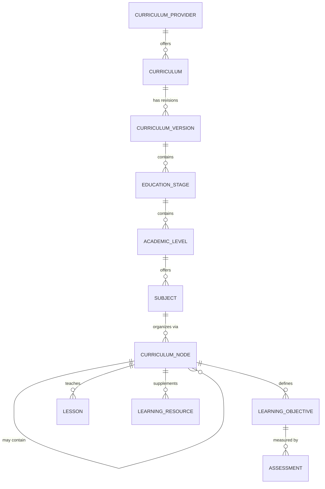

# LearnFlow — Phase 10B: Universal Curriculum Architecture

**Scope:** Design one curriculum abstraction capable of supporting Kenya CBC, Cambridge International, Pearson Edexcel, and the American K-12 pathway. Conceptual/logical design only — no SQL (that begins at Phase 10C).
**Status:** Draft — pending approval before Phase 10C (Database Impact Review).
**Builds on:** Phases 1–9 and Phase 10A — approved. All prior decisions are authoritative except the revisions in Section 0.

---

## 0. Carry-Forward from Phase 10A

| # | Decision | Status | Impact |
|---|---|---|---|
| 1 | "LearnFlow" confirmed; branding must be configurable (name, logo, colors, contact info, domain), not hardcoded — for both eventual rebrand and future white-label tenants | Confirmed. Out of scope for this curriculum-focused phase, but carried forward explicitly so it isn't dropped: `organizations.branding` (Phase 5) already exists as an unused placeholder for per-tenant white-label branding; a platform-wide default-brand config belongs in `system_settings`. Both are addressed at the schema level in Phase 10C. |
| 2 | American Curriculum = generic U.S. K-12 pathway (Elementary/Middle/High School); Common Core/NGSS/state standards deferred | Confirmed, and used directly in Section 4 below. |
| 3 | Independent Learner = self-created `family`-type Organization; the learner holds both `org_admin` and `student` User Roles simultaneously (multi-role, already supported) — not a new "Owner" role and not an org-less user pattern | Confirmed and clarified: "Owner/Administrator" in the approval is read as *holding the existing `org_admin` role*, not a new role type. Flagged for explicit confirmation below, since it wasn't stated in those exact terms before. |
| 4 | Community Participation MVP: networking events, announcements, calendar, RSVP/attendance, workshops/extracurricular events. Deferred: forums, social networking, family profiles, groups, inter-family DMs | Confirmed. No impact on this phase. |
| 5 | MVP-vs-Future sequencing (curriculum engine first) | Confirmed, reflected in this phase's exclusive focus on the curriculum abstraction. |
| 6 | New: introduce **Curriculum Provider** above Curriculum, with the full ten-layer hierarchy | This entire phase. |

## 1. The Design Principle That Makes This Universal

A fixed number of hierarchy levels cannot honestly represent four different curricula — CBC's Strand/Sub-strand structure, Cambridge's Unit/Topic structure, and a generic American Unit/Chapter structure are not the same depth or shape. Forcing them into identical fixed levels would mean either padding shallow curricula with meaningless empty levels or truncating deep ones.

The resolution is a **self-referencing Curriculum Node**: a single entity that can contain other instances of itself, to any depth. CBC's Strand → Sub-strand becomes two levels of nested nodes; Cambridge's Unit → Topic becomes two levels of nested nodes; a simpler curriculum can use one level, or none. This is the one piece of real structural design in this phase — everything else in the hierarchy is comparatively conventional.

## 2. The Ten-Layer Hierarchy

| Layer | Purpose | Scope |
|---|---|---|
| **Curriculum Provider** | The issuing/governing body — KICD, Cambridge International, Pearson, or LearnFlow itself (for the platform-defined generic American pathway, since no single external body governs it). | Platform-level |
| **Curriculum** | A named program under a Provider — e.g., "CBC," "Cambridge Pathway," "American K-12 Pathway." | Platform-level |
| **Curriculum Version** | A dated/labeled revision of a Curriculum — e.g., a future CBC revision, an updated Cambridge syllabus year. Directly serves the Phase 10D requirement for curriculum versioning and historical academic records. | Platform-level |
| **Education Stage** | A broad phase within a version — CBC's Pre-Primary/Primary/Junior Secondary/Senior Secondary; Cambridge Primary/Lower Secondary/Upper Secondary/Advanced; American Elementary/Middle/High School. | Platform-level |
| **Academic Level** | The grade/year/form equivalent within a stage — e.g., Grade 9, Year 9, Stage 9. The display label (Grade/Year/Form/Stage) is a property of the row, not a hardcoded term — this already matches the `name` field the existing `grades` table carries. | Platform-level |
| **Subject** | A taught subject at a given Academic Level — Mathematics, English, Integrated Science, etc. | Platform-level, with a lightweight cross-level grouping tag (see Section 4 note on reusability) |
| **Curriculum Node** | The recursive content-organization unit within a Subject (Section 1). | Platform-level |
| **Learning Objective** | What a Curriculum Node teaches — the generalized replacement for the existing `competencies` table (Section 7). | Platform-level |
| **Lesson / Learning Resource** | A Lesson is a structured teaching unit; a Learning Resource is supplementary material (worksheet, video, reading) that may attach to a Lesson or stand alone at the Curriculum Node level — two related but distinct entities, both explicitly named in the Phase 10 requirements. | Platform-level by default, tenant-authored variant supported (Section 5) |
| **Assessment** | Unchanged in concept from the existing `assessments` table; optionally linkable to a Learning Objective directly, for standalone reference assessments not tied to one specific graded Assignment. | Mixed — see Section 5 |

## 3. Generalized Pathway / Track

The existing CBC-specific "Pathway" (STEM / Social Sciences / Arts & Sports Science, at Senior Secondary only) does not disappear — it generalizes. **Academic Level gains an optional Track concept**, reusable across curricula: CBC's Pathways, Cambridge's AS/A-Level subject combinations, and American High School elective/major-focus tracks are all instances of the same underlying idea — an optional specialization a learner selects at a given level, which then filters which Subjects are available. Not every Academic Level has one; where a curriculum has no such concept, it's simply unused.

## 4. Validating the Hierarchy Against All Four Curricula

| | CBC (Provider: KICD) | Cambridge (Provider: Cambridge International) | Edexcel (Provider: Pearson) | American (Provider: LearnFlow) |
|---|---|---|---|---|
| Curriculum | Competency-Based Curriculum | Cambridge Pathway | Edexcel International | American K-12 Pathway |
| Education Stages | Pre-Primary, Primary, Junior Secondary, Senior Secondary | Cambridge Primary, Lower Secondary, Upper Secondary (IGCSE), Advanced (AS & A Level) | Analogous IGCSE/International A Level stages | Elementary, Middle, High School (per Phase 10A Decision 2) |
| Academic Levels | PP1–PP2, Grade 1–6, Grade 7–9, Grade 10–12 | Stage 1–6, Stage 7–9, IGCSE years, AS/A Level | Provider-specific year labels | Grade K–5, 6–8, 9–12 |
| Track | STEM / Social Sciences / Arts & Sports Science (Senior Secondary only) | AS/A-Level subject combinations | Similar subject-combination model | Optional elective/major-focus tracks (High School) |
| Curriculum Node | Strand → Sub-strand | Unit → Topic | Specification content areas | Unit → Chapter |
| Learning Objective | Learning Outcome | Learning Objective (Cambridge's own term matches directly) | Specification-defined outcome | Generic objective, with Common Core/NGSS/state-standard tagging as a named future extension (Phase 10A Decision 2) |

All four fit without forcing a level onto a curriculum that doesn't have it (Track is simply unused for stages where it doesn't apply; Curriculum Node depth varies freely).

**Reusable subjects note:** Subject rows remain scoped per Academic Level (Grade 7 Mathematics and Grade 9 Mathematics are different rows, since content genuinely differs), but a lightweight cross-level grouping tag ties same-discipline subjects together for continuity — e.g., tracking a Student's "Mathematics" thread across Grade 7→8→9, or for cross-curriculum reporting. Flagged as a design choice requiring confirmation, since the alternative (a single reusable Subject definition instantiated per level) is also defensible and has different reporting trade-offs.

## 5. Ownership: Platform-Level vs. Tenant-Authored

Every layer from Curriculum Provider through Learning Objective is **platform-level, shared reference data** by default — no tenant owns "Mathematics" or "CBC." This matches the original Phase 2/4 decision that curriculum architecture must support future tenant-authored and licensed content without redesign.

Lesson and Learning Resource are where tenant authorship actually happens, extending the pattern the existing `lessons` table already has (`author_type`, `authoring_organization_id`) to Learning Resource as well: `platform` (LearnFlow-curated, the MVP default), `tenant` (authored by a specific Organization, visible only within it unless explicitly shared), or `licensed` (third-party, future). No new ownership *concept* is introduced — this generalizes what's already approved and, per the earlier repository review, already partially implemented.

## 6. Publishing & Versioning Lifecycle

The existing implementation already carries a `draft → published → archived` status (with `published_at`) on subjects and lessons. Phase 10B proposes extending this same lifecycle to every authored layer — Curriculum Version, Curriculum Node, Learning Objective, Lesson, and Learning Resource — so "is this curriculum content live yet" is answered the same way everywhere rather than being ad hoc per table. A **Curriculum Version** additionally needs an explicit `is_current` marker (or equivalent) distinguishing the version actively offered to new enrollments from historical versions retained for existing learners' records (Phase 10D).

## 7. Mapping Existing Architecture to the New Hierarchy

| Existing (Phase 5) | Classification | New home |
|---|---|---|
| `curricula` | **MUST CHANGE** | Splits into `curriculum_providers` (new) + a reshaped `curricula` referencing a Provider, supporting more than the single CBC row it holds today. |
| *(none — new)* | **NEW** | `curriculum_versions` |
| *(none — new)* | **NEW** | `education_stages` |
| `grades` | **MUST CHANGE** | Becomes `academic_levels`, repositioned under Education Stage instead of directly under Curriculum. |
| `pathways` | **SHOULD CHANGE** | Generalizes into the Track concept (Section 3), reusable beyond CBC rather than CBC-only. |
| `subjects` | **SHOULD CHANGE** | Same core concept; gains Curriculum Version/Provider traceability and the cross-level grouping tag (Section 4). |
| `competencies` | **MUST CHANGE** | Renamed `learning_objectives`, re-scoped under Curriculum Node instead of directly under Subject. |
| *(none — new)* | **NEW** | `curriculum_nodes` (self-referencing) |
| `lessons` | **SHOULD CHANGE** | Re-scoped under Curriculum Node; ownership fields (`author_type`, `authoring_organization_id`) already exist and carry forward unchanged. |
| *(none — new)* | **NEW** | `learning_resources`, mirroring Lesson's ownership pattern |
| `assessments` | **COULD CHANGE LATER** | Core table unchanged; an optional link to Learning Objective for standalone/reference assessments is a later refinement, not urgent now. |
| `students`, `assignments`, `progress_records`, all Identity/Membership/Role tables, all three relationship tables, Communication, Subscription, Notification/Audit/Security | **DO NOT CHANGE** | Entirely outside this phase's scope; Phase 10 touches only the curriculum side of the schema. |

## 8. Relationship to the Existing Implementation

The repository already contains curriculum-authoring migrations with a `topics` table, a `learning_objectives` table, and a draft/published/archived workflow on subjects and lessons — built ahead of the original Phase 1–9 MVP scope (which specified platform-curated-only content at launch), and independently anticipating some of this direction. Whether the existing `topics` table can become `curriculum_nodes` directly, or needs restructuring to support true recursive nesting and multi-curriculum scope, is a question for Phase 10C's database impact review, which examines the actual current schema state rather than this phase's conceptual one. Flagged here so it isn't lost between phases.

---

## Architectural Decisions Made
1. Curriculum Provider introduced as the top of the hierarchy, with LearnFlow itself standing in as the provider for the platform-defined generic American pathway (Section 2).
2. A self-referencing Curriculum Node is the mechanism that makes the hierarchy genuinely usable across curricula of different structural depth (Section 1) — the core design decision of this phase.
3. CBC's Pathway generalizes into a reusable Track concept at Academic Level, applicable to Cambridge/Edexcel subject combinations and American elective tracks alike (Section 3).
4. `competencies` is renamed `learning_objectives` and re-scoped under Curriculum Node — deliberate terminology generalization, not an unexplained rename (Section 7).
5. Learning Resource is introduced as a first-class entity distinct from Lesson, mirroring Lesson's existing platform/tenant/licensed ownership pattern.
6. The draft/published/archived lifecycle already in use for subjects/lessons is proposed to extend across every authored layer in the hierarchy (Section 6).
7. Independent Learner "Owner/Administrator" status is confirmed to mean holding the existing `org_admin` role, not a new role type.

## Assumptions
1. Subject remains scoped per Academic Level (not a single cross-level reusable definition), with a lightweight grouping tag providing continuity — flagged as a genuine design fork in Section 4, not a settled fact.
2. Curriculum Provider needs a way to distinguish real external bodies (KICD, Cambridge, Pearson) from LearnFlow-as-provider for the generic American pathway; the exact mechanism is left to Phase 10C.
3. The existing `topics`/`learning_objectives` tables in the live implementation are related to, but not necessarily identical to, this phase's Curriculum Node/Learning Objective design — reconciling them precisely is Phase 10C's job, not asserted here.

## Risks
1. **Ten layers is real complexity.** Every additional layer is a real join for every curriculum-content query; Phase 10C and Phase 10D need to keep the common-path queries (e.g., "show a Student's current Subjects") reasonably shallow despite the deep model underneath.
2. **Reconciling with already-built curriculum-authoring work** (Section 8) carries real migration risk if the existing `topics` table diverges structurally from Curriculum Node — better understood now than discovered mid-migration in Phase 10C.
3. **Track/Pathway generalization** changes an already-shipped CBC concept; existing CBC pathway data and any code referencing it by its current shape needs a compatibility path, not a silent replacement.

## Questions Requiring Approval
1. Confirm Subject remains scoped per Academic Level with a cross-level grouping tag, rather than a single reusable Subject definition instantiated per level.
2. Confirm the draft/published/archived lifecycle should extend to every authored layer (Curriculum Version, Curriculum Node, Learning Objective, Lesson, Learning Resource), not just Subject/Lesson as today.
3. Confirm LearnFlow standing in as the Curriculum Provider for the generic American pathway.
4. Confirm the Independent Learner "Owner/Administrator" reading (existing `org_admin` role, not a new role type) is correct.
5. Approve Phase 10B to proceed to Phase 10C (Database Impact Review).
