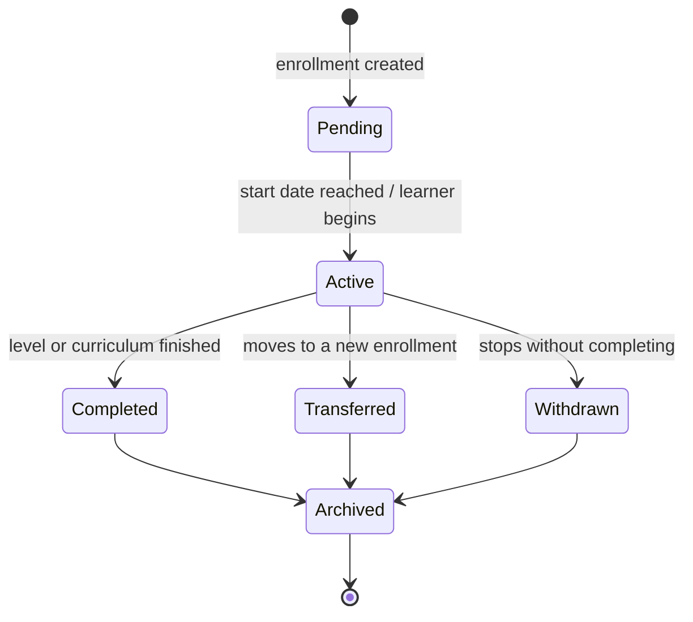

# LearnFlow — Phase 10D: Learner Enrollment & Academic Progression

**Scope:** Curriculum enrollment, transfers, historical records, multiple curricula, academic progression, graduation, independent learners, parent-managed learners, and the Academic Period concept. Conceptual/logical design — no SQL.
**Status:** Approved, with refinements applied in this revision (enrollment-category distinction, formal lifecycle, `curriculum_enrollment_id` in place of a bare `academic_period_id`). See Section 0.
**Builds on:** Phases 1–9 and Phase 10A–10C — approved.

---

## 0. Carry-Forward from Phase 10C

| # | Decision | Status |
|---|---|---|
| 1 | `pathways` → `tracks` | Confirmed. |
| 2 | Provider / Standards Framework / Content Ownership as three independent extensibility mechanisms | Confirmed. |
| 3 | `curriculum_nodes` cycle prevention via a validation trigger, treated as a production requirement | Confirmed. |
| 4 | Reconciliation with the live `topics` table deferred to Phase 10L | Confirmed. |
| 5 | Academic Period belongs here, not Phase 10C — see reasoning below | Applied. |

**Why Academic Period belongs here:** Phase 10C's hierarchy defines what a curriculum *is* — platform-level, timeless structure. Academic Period defines *when* a specific learner studies a slice of it — a tenant-level, time-bound fact about one learner's journey. That's this phase's subject, not 10C's.

## 1. Academic Period

Tenant-scoped, self-referencing, mirroring `curriculum_nodes`' pattern applied to time: `organization_id`, `parent_period_id` (nullable), `period_type` (`year`/`term`/`semester`/`quarter` — TEXT+CHECK), `name`, `start_date`, `end_date`.

**Optional (nullable) on enrollment, confirmed.** Organizations with formal academic calendars use it; self-paced homeschooling families and other continuous/rolling-enrollment contexts are not forced to define one.

## 2. Curriculum Enrollment

The historical bridge between tenant-scoped Students and the platform-level curriculum hierarchy: a new `curriculum_enrollments` table.

| Field (conceptual) | Purpose |
|---|---|
| `student_id` | The learner. |
| `curriculum_version_id` | The specific version — "CBC 2024," not just "CBC" — so a future revision never retroactively changes what a past enrollment meant. |
| `academic_level_id` | Grade/year/form at time of enrollment. |
| `track_id` | Nullable — only where the curriculum has one. |
| `academic_period_id` | Nullable (Section 1). |
| `enrollment_category` | `primary` / `supplementary` (Section 3) — extracurriculars are explicitly **not** represented here (Section 3). |
| `is_primary` | Convenience flag mirroring `enrollment_category = 'primary'`. |
| `status` | The formal lifecycle in Section 4. |
| `transferred_from_enrollment_id` | Nullable, self-referencing — links a new enrollment back to the one it succeeded. |
| `enrolled_at` / `ended_at` | Lifecycle timestamps. |

This is the authoritative, historical record of what a Student actually studied and when.

## 3. Three Enrollment Categories — Not Two

Refined per approval into three distinct concepts, so extracurriculars are never treated as equivalent to a learner's primary academic curriculum:

- **Primary Academic Enrollment** — exactly one active `curriculum_enrollments` row with `enrollment_category = 'primary'` per Student at a time, enforced with a partial unique index (`unique on curriculum_enrollments(student_id) where enrollment_category = 'primary' and status = 'active'`) — the same technique already used for `curriculum_versions.is_current` (Phase 10C).
- **Supplementary Academic Enrollment** — additional `curriculum_enrollments` rows (`enrollment_category = 'supplementary'`) for genuinely formal study beyond the primary — e.g., sitting Cambridge IGCSE as an external candidate alongside a primary CBC enrollment. Still a real curriculum enrollment, still carries a curriculum version and academic level; just not the learner's main one.
- **Extracurricular Programme Enrollment** — **not** a `curriculum_enrollments` row at all. French, German, Chess, Music, Coding, and similar non-core offerings get their own lightweight `programme_enrollments` concept, introduced here only as a placeholder (`programme_id`, `student_id`, a simpler `active`/`completed`/`withdrawn` status, optional `academic_period_id`) — fully designed in Phase 10F (Programme Architecture), which is explicitly next in the source document's sequence for this domain.

## 4. Standardized Enrollment Lifecycle

Applies to `curriculum_enrollments` (Primary and Supplementary alike). Programme Enrollment (Section 3) uses its own simpler lifecycle, designed in Phase 10F.

## 5. Deprecating `students.grade_id` / `students.pathway_id`

**MUST CHANGE, as a controlled migration, not an immediate removal (per approval).** `curriculum_enrollments` becomes the authoritative source of a learner's current academic placement (the active Primary enrollment). The existing direct columns are kept temporarily during Phase 10L's implementation, backfilled from the new model, and removed only once the migration is verified — not dropped in the same step they're superseded.

## 6. Transfers, Progression & Graduation

All three are the same mechanism (confirmed, not new): the current enrollment moves to `Transferred` or `Completed`, and — for progression specifically — **a new `curriculum_enrollments` row is always created rather than updating the existing one in place**, so each completed academic level remains its own permanent historical record rather than being overwritten. A transfer additionally sets `transferred_from_enrollment_id` on the new row for a clean audit trail. Graduation is a `Completed` status reached at a curriculum's final Academic Level — no separate entity needed for the event itself, though it's the natural future trigger point for a Certificate (not designed in this phase).

This phase does not invent promotion criteria (mastery thresholds, attendance minimums) — none exist in the approved PRD, and the schema is designed to support whatever rule is defined later without needing to change shape.

## 7. Independent Learners vs. Parent-Managed Learners

Unchanged: no special-casing. Both enroll via the identical `curriculum_enrollments` mechanism — the schema doesn't distinguish who initiated the enrollment, only whose record it is.

## 8. Ownership & RLS Implications

Both new tables are tenant-scoped, following the existing Phase 5 pattern:

- `academic_periods`: `organization_id in (select auth_organization_ids())`.
- `curriculum_enrollments`: scoped through `student_id → students.organization_id`, then filtered by the same relationship-based visibility already governing Progress and Assignments (Parent sees their linked child's; Teacher/Tutor sees their assigned students'; Organization Administrator sees all within the tenant).

## 9. Academic Records Relate to Enrollment, Not Directly to Student

Per approval, `progress_records`, `assignments`, and future time-dependent academic entities (attendance, certificates, transcripts) should reference **`curriculum_enrollment_id`**, not a bare `academic_period_id`. This is a deliberate refinement of this phase's earlier draft: `curriculum_enrollment_id` already carries the academic period, academic level, and curriculum version transitively — adding a second, parallel `academic_period_id` column would be redundant and risks the two drifting out of sync. One reference is enough, and it's the richer one. Recommended for Phase 10L to sequence against the already-approved Phase 5 tables.

---

## Architectural Decisions Made
1. Academic Period confirmed optional/nullable on enrollment.
2. Enrollment is split into three categories — Primary, Supplementary, and Extracurricular Programme — with only the first two living in `curriculum_enrollments`; extracurriculars get their own, separately-designed Programme Enrollment concept.
3. A standardized six-state lifecycle (Pending → Active → Completed/Transferred/Withdrawn → Archived) governs `curriculum_enrollments`.
4. Progression always creates a new enrollment row rather than updating in place, preserving each completed level as its own permanent record.
5. `students.grade_id`/`pathway_id` deprecation is a controlled, phased migration (Phase 10L), not an immediate drop.
6. Academic records reference `curriculum_enrollment_id`, not a parallel `academic_period_id` — a refinement of this phase's own earlier draft, made to avoid a redundant, driftable pair of columns.

## Assumptions
1. `enrollment_category` and `is_primary` are treated as one fact expressed two ways (a text category plus a convenience boolean) rather than two independently-set fields that could disagree — the boolean should be derived, not separately writable.
2. Programme Enrollment's exact shape is a placeholder here; its real design is Phase 10F's responsibility.
3. The partial-unique-index technique enforcing "exactly one active Primary enrollment" is assumed sufficient; no additional application-level locking is anticipated, but hasn't been stress-tested at this conceptual stage.

## Risks
1. **Phased `grade_id`/`pathway_id` deprecation** means two sources of truth coexist temporarily during Phase 10L — a real, if time-boxed, consistency risk that needs an explicit backfill-and-verify step, not just "migrate eventually."
2. **Enrollment-category/is_primary drift**, if the boolean is ever writable independently of the category field, could produce contradictory rows — worth enforcing as derived, not just documented as such.
3. **Programme Enrollment being only a placeholder** here means Phase 10F inherits a real dependency (the category split assumes Programme Enrollment will exist) — low risk given it's explicitly next in sequence, but worth naming.

## Questions Requiring Approval
1. Confirm `enrollment_category` as the authoritative field with `is_primary` derived from it, not independently settable.
2. Confirm the six-state lifecycle (Section 4) as final, or adjust before it's carried into Phase 10L.
3. Approve Phase 10D (as refined) and proceed to Phase 10E (Public Website Architecture).
