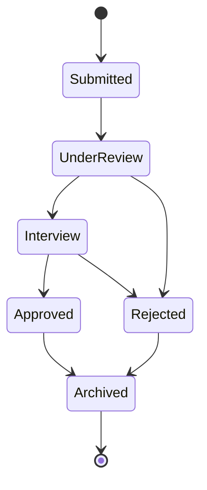

# LearnFlow — Phase 10E: Public Website Architecture

**Scope:** Homepage, About, Why Choose Us, Services, Guide, Testimonials, FAQs, Contact, Consultation Booking, Instructor Recruitment, Merchandise, SEO.
**Status:** Approved, with refinements applied in this revision (Guide as a knowledge hub, instructor-application detail table + recruitment lifecycle, a public Events stub, explicit CMS/SEO framing). See Section 0.
**Builds on:** Phases 1–9 and Phase 10A–10D — approved.

> **SUPERSEDED IN PART — Stage 3 binding decisions, 2 September 2026.** See
> [`2026-09-02-stage-3-scope-decision-record.md`](./2026-09-02-stage-3-scope-decision-record.md).
>
> - **Instructor documents (Sections 3–4):** Stage 3 ships the CV/document journey
>   only, into the private `instructor-applications` bucket, max 5242880 bytes,
>   `application/pdf` and `application/vnd.openxmlformats-officedocument.wordprocessingml.document`
>   (`.pdf`, `.docx`). Certificate uploads, passport photographs/headshots, JPEG/PNG,
>   and the earlier 10,485,760-byte limit are **superseded and out of Stage 3 scope**.
>   `certificate_storage_paths` and `photo_storage_path` remain reserved, unused
>   fields. This is deliberate data minimization, not an omission.
> - **Merchandise media (Sections 3 and 6):** Stage 3 merchandise is a text-first
>   catalogue and inquiry feature. No `merchandise-images` bucket, no media upload
>   journey, and no external-image URL workflow are approved.
>   `merchandise_items.media_path` is a reserved, nullable forward-compatibility
>   field and is **not** a supported capability.
>
> Historical text below is retained for provenance. Expanding either capability
> requires a new architecture decision and security review.

---

## 0. Carry-Forward from Phase 10D

Unchanged from the prior revision — see Phase 10D for enrollment-category and lifecycle decisions, which don't affect this unauthenticated, public-facing phase.

## 1. Architectural Placement

Unchanged: same TanStack Start codebase, a new public route group outside `_authenticated`, SSR for crawlability. No separate site or tool.

## 2. Content Is CMS-Managed, Not Hardcoded

Per approval, About/Services/Testimonials/Guide/FAQs (and the rest of `site_content`) are administered through the **existing Platform Administration module** (Super Administrator portal, approved since Phase 3) — this is a new _responsibility_ added to an already-approved portal, not a new portal. No public-website content is permanently hardcoded in the application; every editable surface is a database row a platform administrator can change without a code deploy.

## 3. New Entities

- **`site_content`** — editable copy blocks for Home/About/Why Choose Us/Services, keyed similarly to `system_settings`.
- **`guide_articles`** — the Guide, confirmed as a genuine knowledge hub, not a simple help page: `title`, `slug`, `content_body`, `category` (`getting_started` / `homeschooling_info` / `curriculum_selection` / `enrollment_guidance` / `general`), `status`, `published_at`, `download_url` (nullable, future), `video_url` (nullable, future), `display_order`. Distinct from `faqs` — Guide holds longer-form articles; FAQs stays quick question/answer pairs.
- **`testimonials`**, **`faqs`**, **`merchandise_items`** — unchanged from the prior revision.
- **`public_inquiries`** — the shared core record (confirmed as the primary workflow) for Contact, Consultation, Instructor Application, and Merchandise Enquiry: `inquiry_type`, `name`, `email`, `phone`, `message`, `details` (jsonb, for the simple cases), `status`, `created_at`.
- **`instructor_application_details`** — refinement per approval: where an inquiry type needs real structured data and documents, it gets a **dedicated detail table** linked back to the shared record, rather than overloading `details` jsonb or forking into a fully separate workflow. `inquiry_id` (FK to `public_inquiries`, one-to-one), `subjects_of_interest`, `years_experience`, `qualifications_summary`, `cv_storage_path`, `certificate_storage_paths` (array), `photo_storage_path`, and its **own** `status` carrying the recruitment lifecycle (Section 4) — deliberately richer than the shared `public_inquiries.status`, which stays simple and generic across all four inquiry types for a consistent cross-type staff view. This same pattern (shared core + optional detail table) is exactly how Consultation Booking or Merchandise could gain real structure later without redesigning the shared table — the extensibility the approval asked for.

## 4. Instructor Application Lifecycle

**Document handling:** CVs, certificates, and passport photographs are sensitive PII and should not be written directly to Storage from an unauthenticated browser session. Recommend routing instructor-application uploads through a server-side Route Handler (validating file type/size, applying rate limiting) that writes to a new, **private** `instructor-applications` Storage bucket, readable only by `is_platform_admin()` — not a client-side direct-upload pattern, and not the more permissively-read `lesson-content`/`avatars` bucket shape from Phase 5.

## 5. Public Events (Stub for Phase 10G)

Per approval, the Events model is introduced now so Phase 10G's full Community architecture can build on it rather than replace it:

- **`events`** — `title`, `description`, `event_type`, `start_at`, `end_at`, `location`, `organization_id` (**nullable** — null means a platform-wide LearnFlow event; a value means an Organization-specific event), `is_public` (whether it's listed/registrable on the public site at all), `status`.
- **`event_registrations`** — `event_id`, and _either_ `user_role_id` (an authenticated platform member registering) _or_ `registrant_name`/`registrant_email` (an anonymous public registrant) — exactly one of the two populated, never both, never neither.

This phase only needs enough of this model to support a public events listing page with optional public registration. Member-specific participation, tutor/family-specific flows, and administration tooling belong to Phase 10G, building on these same two tables rather than introducing parallel ones.

## 6. Page-by-Page Mapping

| Page                                                                 | Backed by                                                                                                           |
| -------------------------------------------------------------------- | ------------------------------------------------------------------------------------------------------------------- |
| Home, About, Why Choose Us, Services                                 | `site_content`                                                                                                      |
| Guide                                                                | `guide_articles`                                                                                                    |
| Testimonials                                                         | `testimonials`                                                                                                      |
| FAQs                                                                 | `faqs`                                                                                                              |
| Contact                                                              | `public_inquiries` (`contact`)                                                                                      |
| Consultation Booking                                                 | `public_inquiries` (`consultation`) — request-capture only, no scheduling, per approval                             |
| Instructor Recruitment                                               | `public_inquiries` + `instructor_application_details` (Section 3–4)                                                 |
| Merchandise                                                          | `merchandise_items` + `public_inquiries` (`merchandise`) — catalog and inquiry only, no cart/checkout, per approval |
| Events (new, not in the original page list, added per this approval) | `events` + `event_registrations`                                                                                    |

## 7. SEO — Platform-Level, Reserved Explicitly

Per approval, metadata management, Open Graph tags, structured data, sitemap generation, and `robots.txt` are platform-level architectural concerns, not tied to any tenant: per-route meta/OG configuration, a generated `sitemap.xml` sourced from published `site_content`/`guide_articles`/`testimonials`/`faqs`/`merchandise_items`/`events`, JSON-LD where it clearly helps (Organization info, FAQ markup, Event markup), and a reviewed `robots.txt` (one already exists in the repository per the earlier snapshot and needs confirming against the now-larger public route set).

## 8. Ownership & RLS

Unchanged in shape from the prior revision, extended to the new tables:

- `site_content`, `guide_articles`, `testimonials`, `faqs`, `merchandise_items`, public `events`: `for select using (status = 'published')`, no organization/role check; write is `is_platform_admin()` only.
- `public_inquiries`: anonymous INSERT allowed; SELECT is `is_platform_admin()`-only.
- `instructor_application_details`: **no** anonymous SELECT at all (unlike the other public tables) — even the applicant themselves has no authenticated account to read it back through at MVP; `is_platform_admin()`-only, full stop.
- `event_registrations`: anonymous INSERT allowed when the event `is_public`; SELECT restricted to the registrant (if authenticated, matched by their own `user_role_id`) or `is_platform_admin()`.

---

## Architectural Decisions Made

1. Guide is a proper knowledge hub (`guide_articles`) distinct from FAQs, not a simple help page.
2. `instructor_application_details` is introduced as this phase's example of the shared-core-plus-detail-table pattern, which is also the extensibility path for Consultation/Merchandise later without redesign.
3. Instructor applications get their own six-state recruitment lifecycle, separate from the simpler shared `public_inquiries.status`.
4. Sensitive application documents route through a server-side upload handler into a new, strictly private Storage bucket — not direct anonymous client writes.
5. A minimal `events`/`event_registrations` model is introduced now specifically so Phase 10G extends it rather than replacing it.
6. All public-website content is explicitly CMS-managed through the existing Platform Administration module — no hardcoded marketing copy.
7. SEO mechanisms are explicitly scoped as platform-level, not tenant-level, concerns.

## Assumptions

1. `event_registrations` enforces "exactly one of authenticated member or anonymous registrant" as a modeling rule; the precise mechanism (a CHECK-style rule vs. application-level enforcement) is left to Phase 10L.
2. Instructor application documents are assumed sensitive enough to warrant zero applicant-side read access at MVP (no applicant portal to check status) — flagged as a real UX trade-off, not just a technical default.
3. `certificate_storage_paths` as an array is assumed sufficient for multiple certificates; a dedicated documents sub-table remains an option if richer per-document metadata (upload date, document type) becomes necessary.

## Risks

1. **No applicant-facing status visibility** (Assumption 2) may generate support-inbox load ("did you get my application?") that a future lightweight status-lookup page could resolve — noted, not solved here.
2. **Server-side upload handling** for instructor applications is more implementation work than a direct client upload would be, and is a new pattern relative to how Storage has been used elsewhere in this project — worth flagging to Phase 10L as a genuinely new piece of backend work, not a minor variation.
3. **Public Events as a stub** means Phase 10G inherits real structural assumptions (nullable `organization_id`, the either/or registrant rule) it didn't design itself — low risk given it's explicitly next, but worth naming as with the Programme Enrollment stub in Phase 10D.

## Questions Requiring Approval

1. Confirm zero applicant-facing status visibility for instructor applications at MVP (no status-lookup page), or request one be scoped now.
2. Confirm server-side (Route Handler-mediated) uploads for instructor application documents, rather than direct client-to-Storage uploads.
3. Confirm the public Events stub (Section 5) as sufficient groundwork for Phase 10G, or adjust its shape now before Phase 10G builds on it.
4. Approve Phase 10E (as refined) and proceed to Phase 10F (Programme Architecture).
