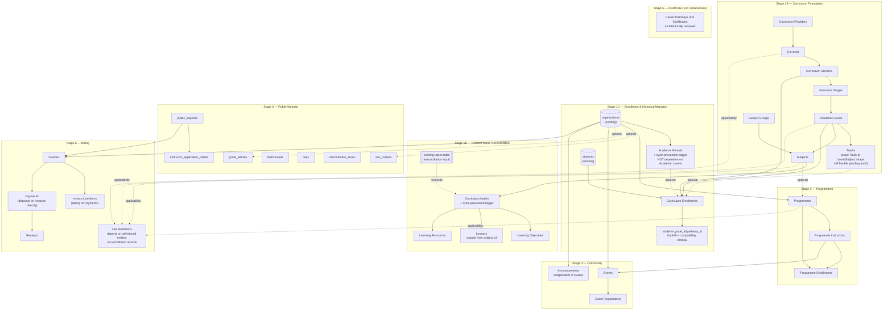

# LearnFlow — Phase 10L: Implementation Strategy (Finalized)

**Scope:** An incremental, production-safe, dependency-accurate strategy for implementing the approved Phase 10A–10K architecture. Not SQL, migration files, application code, or Lovable prompts. The final phase of Phase 10 planning.
**Status:** Approved and finalized. This revision corrects real dependency errors and materially strengthens migration safety, testing, and rollback rigor — see Section 0.
**Builds on:** Phases 1–9 and Phase 10A–10K — approved, all finalized.
**No new product scope is introduced in this revision** — every change here is about _how_ the already-approved architecture gets built safely, not _what_ gets built.

> **Stage 3 scope amendment (2 September 2026).** Two binding decisions in
> [`2026-09-02-stage-3-scope-decision-record.md`](./2026-09-02-stage-3-scope-decision-record.md)
> override any Stage 3 statement here that implies otherwise:
> (1) instructor uploads are CV/document only — private `instructor-applications`
> bucket, 5242880 bytes, PDF/DOCX; the earlier 10,485,760-byte PDF/JPEG/PNG,
> certificate and passport-photograph proposal is **superseded**;
> (2) merchandise is **text-first** — no Storage bucket, no upload journey, no
> external-image URL workflow; `merchandise_items.media_path` is a reserved,
> nullable, non-functional field.

---

## 0. Corrections Applied in This Revision

The prior draft had three categories of real error, not just missing detail, and they're worth naming plainly rather than glossed over:

1. **The dependency graph encoded preferred build order, not actual foreign-key dependencies**, in at least six places (Subject Groups/Subjects direction, Academic Periods on Academic Levels, Career Aspirations on Curriculum Enrollments, Fee Definitions on enrollment records instead of definitional entities, Announcements on Events, Payments on Line Items instead of Invoices). All corrected in Section 2.
2. **An unverified assumption was stated as fact** — the prior revision referred to "existing Vercel Middleware / Upstash rate-limiting infrastructure" as something to extend, without any confirmed evidence it was actually deployed, only that it was architecturally approved back in Phase 8. Corrected in Section 9: approved architecture and confirmed deployed implementation are now treated as separate facts everywhere in this document.
3. **A basic arithmetic error**: the prior readiness declaration said "twelve phases (10A–10K)." 10A through 10K is eleven phases; twelve is 10A through 10L, counting this phase itself. Corrected in Section 12. Phase 10G's own status line is also corrected elsewhere in this project's document set — it was already approved via the Phase 10K/10L revisions and shouldn't have still read "draft."

## 1. Final Implementation Sequence

Stage 1 is subdivided — it's substantially larger and higher-risk than every other stage, and treating it as one release would be exactly the kind of large irreversible change this whole planning effort has avoided elsewhere:

- **Stage 1A — Universal Curriculum Foundation:** Curriculum Providers, Curricula, Curriculum Versions, Education Stages, Academic Levels, Tracks, Subject Groups, Subjects.
- **Stage 1B — Content Spine Reconciliation:** reconcile the existing `topics` table against Curriculum Nodes, Learning Objectives, Lessons migration, Learning Resources, recursive-hierarchy protection.
- **Stage 1C — Learner Enrollment & Historical Migration:** Academic Periods, Curriculum Enrollments, existing Student academic-placement backfill, the `students.grade_id`/`pathway_id` compatibility transition, historical Progress/Assignment relationship migration where required.
- **Stage 2 — Programme Architecture.**
- **Stage 3 — Public Website** (may ship without Community Events enabled — the public Events surface stays feature-gated until Stage 4 installs the complete Events/Event Registrations model).
- **Stage 4 — Community.**
- **Stage 5 — REMOVED.** Career Pathways / Certificates are architecturally removed, not deferred (see Phase 10H, superseded). The numbering is preserved for historical traceability; there is no replacement stage and nothing is implemented here.
- **Stage 6 — Billing.**
- **Final Architecture Validation → Cursor Handoff.**

Each of 1A/1B/1C, and each of Stages 2–6, is an independently testable deployment checkpoint (Section 11) — not a single large release with internal steps that only get validated together.

## 2. Corrected Migration Dependency Map

This graph now represents actual referenced-table relationships, not preferred sequencing — dashed edges are optional/nullable references (a table that _may_ point at another, not one that requires it to exist first in the same sense a `not null` foreign key does).

## 3. Expanded Pre-Implementation Audit Checklist

Before Stage 1A's first migration is written, establish an authoritative baseline covering — and explicitly _not_ assuming migration files and the currently deployed schema are identical, since they can drift:

- Complete `supabase/migrations/` history.
- The current _actual_ deployed Supabase schema (tables, columns, foreign keys, indexes, CHECK/unique constraints, RLS enablement and policies, helper functions, triggers) — verified directly, not inferred from migration files alone.
- Storage buckets and Storage policies as actually configured.
- Current `system_settings` contents.
- Existing seed/reference curriculum data.
- Generated Supabase/TypeScript types.
- Application queries, services, and hooks that touch any affected table.
- Routes/components depending on `grades`, `pathways`, `topics`, `subjects`, `lessons`, or Student placement fields specifically.
- Current row counts for every table requiring a backfill (Section 6 needs these as a baseline).
- Migration-history/version status (has every migration file actually been applied, in order, with no manual drift).

## 4. Additive-First Compatibility Strategy

The three approved renames — `grades → academic_levels`, `pathways → tracks`, `topics → curriculum_nodes` — remain approved as names. What's corrected here is the assumption that a direct rename is the right first implementation step. The default sequence for all three:

**Add new structure → Backfill → Validate → Switch application reads → Switch application writes → Observe → Deprecate legacy structure → Remove only in a later migration, after verification.**

A direct rename is used only where the Section 3 audit proves it's safe across application code, generated types, RLS policies, functions, and existing data — not assumed safe by default.

## 5. `students.grade_id`/`pathway_id`: Two Options, Resolved After the Audit

`curriculum_enrollments` must become the authoritative source of academic placement, and during the transition the legacy fields and Curriculum Enrollment must never become two independently-writable sources of truth. Two options, not chosen here:

- **A.** The legacy fields become synchronized, read-only compatibility projections of the active Primary Curriculum Enrollment during the transition.
- **B.** All application reads/writes migrate to `curriculum_enrollments` before any academic-placement change is permitted under the new model — a harder cutover, no dual-write window at all.

Which is safer depends on how deeply `grade_id`/`pathway_id` are wired into existing application code (Section 3's audit) — resolved with that evidence in hand, not guessed now.

## 6. Data-Backfill Validation Gates

Every backfill is verified by measurable checks, not just successful execution:

- Expected source row count vs. expected destination row count.
- Unmapped-row count.
- Invalid/null relationship count.
- Duplicate/conflict count.
- Foreign-key integrity.
- Historical-record equivalence, where applicable (a Student's past record should read the same after migration as before).

Legacy records that can't be deterministically reconciled are never guessed at — they're surfaced for review before cutover, not silently mapped to a best guess.

## 7. Staging Rehearsal → Production Workflow

Repository/schema audit → migration design → apply against a disposable/local/staging database → execute backfills → run integrity checks (Section 6) → run RLS tests → run cross-tenant isolation tests → run application regression tests → exercise rollback/recovery → **only then** apply to production. The first execution of any destructive or data-transforming migration never happens against production directly.

## 8. Database Rollback & Recovery Planning

Application deployment rollback is not database rollback — rolling back a Vercel deployment doesn't undo a migration that already ran against the database. Each migration stage defines its own pre-migration backup/recovery point, favors additive/backward-compatible changes where possible (Section 4), and has a forward-fix or recovery procedure — not just "redeploy the previous version." Legacy tables/columns are never dropped in the same release that introduces their replacement (reinforces Section 4/5).

## 9. Verify, Don't Assume: Phase 1–9 Infrastructure Status

Approved architecture and confirmed deployed implementation are treated as separate facts everywhere in this plan, corrected from the prior revision's error (Section 0). Specifically: Phase 8 approved Sentry, Resend, and Vercel Middleware + Upstash Redis rate limiting — none of these were confirmed present in the repository snapshot reviewed earlier in this conversation. If the Section 3 audit shows any of them were never actually implemented, they're recorded as **implementation prerequisites for Phase 10's anonymous-write surfaces (Section 10)**, not assumed already available to extend.

## 10. Phase 10K Security Requirements, Applied Per Stage

Not a one-time mention — a checklist every stage is checked against before being considered done:

- RLS ships before the corresponding UI is exposed.
- Tenant-authored published content never leaks across Organizations.
- Fee Definitions remain administratively restricted.
- Anonymous-write surfaces receive abuse protection _before_ being exposed (Section 9's prerequisite check applies directly here).
- Instructor Application documents remain private and server-mediated.
- Certificate verification remains a narrow server-side projection.
- `curriculum_nodes` and `academic_periods` receive cycle prevention before nested authoring is exposed.
- `event_registrations` receive structural validity constraints.
- Financial integrity rules are enforced before Billing UI becomes available.

## 11. Stage Exit Criteria

No stage is complete merely because its UI renders. Each stage must pass, as applicable: migration success, backfill validation (Section 6), RLS allow/deny tests, cross-tenant isolation tests, relevant integration tests, regression tests against existing functionality, responsive/accessibility checks, a production smoke test, feature-gate verification, and a documented rollback/recovery point. Only then does the next stage begin.

## 12. Scope Clarification

These six stages describe the Phase 10 expansion's implementation specifically — they are not a declaration that every other LearnFlow feature outside Phase 10 is complete or production-hardened. Final Architecture Validation after Stage 6 explicitly includes checking for any outstanding work from the _original_ Phase 1–9 scope (including the post-Lovable architectural review that was requested earlier in this conversation and never completed, due to repository access being blocked at the time) — not just confirming Phase 10 itself.

---

## Final Answers to the Ten Requested Items

1. **Corrected final implementation sequence:** Section 1.
2. **Corrected migration dependency map:** Section 2.
3. **Expanded pre-implementation audit checklist:** Section 3.
4. **Stage 1A/1B/1C breakdown:** Section 1.
5. **Data-backfill validation gates:** Section 6.
6. **Staging and production deployment workflow:** Section 7 (with Section 8's rollback/recovery requirements).
7. **Stage exit criteria:** Section 11.
8. **Remaining implementation risks:**
   - The `topics` reconciliation is still unverified against live data — the largest concrete unknown blocking a precise Stage 1B migration script.
   - Whether Phase 8's rate-limiting/error-tracking/email infrastructure actually exists in the deployed environment is unconfirmed (Section 9) — Stage 3/4's abuse-protection requirements may need to build this from scratch, not extend it.
   - The `grade_id`/`pathway_id` compatibility approach (Option A vs. B, Section 5) can't be finalized until the audit shows how deeply those fields are used in existing application code.
   - Fee Definition equal-specificity conflict detection and derived `paid` status remain real logic to design at implementation time, not yet specified beyond the principle.
9. **Final Phase 10 readiness declaration:** Phase 10A through 10L — **twelve phases** — are complete, reviewed, and approved, including this implementation strategy itself. The architecture is ready. What remains before Stage 1A can be written precisely is not architectural: it's the repository/schema audit (Section 3), which is data-gathering, not design work.
10. **Explicit next action:** a pre-implementation repository and Supabase schema audit, using the actual current codebase and migration history — not the earlier conversation snapshot. No SQL, migration files, Lovable prompts, or implementation code until that audit is completed and reviewed, and Stage 1A is scoped against its findings rather than inference.
